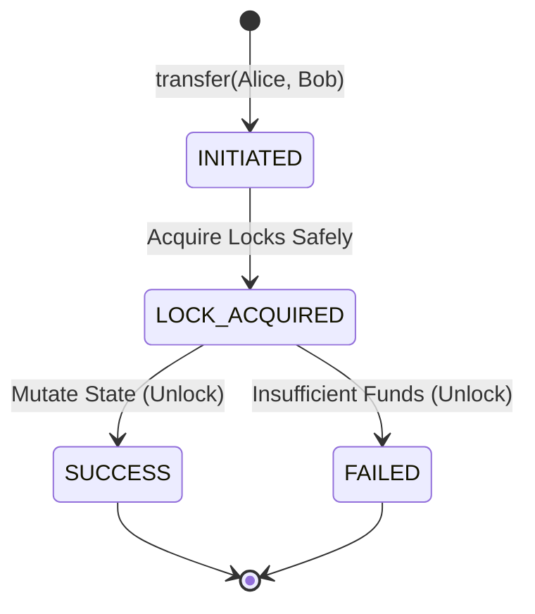

# The Concurrent Ledger (Digital Wallet LLD)

## Overview
A Digital Wallet system (like CoinDCX or Binance) is fundamentally a test of **Concurrency Control, Deadlock Prevention, and Transactional Integrity**. It is not a standard CRUD application. The system must guarantee zero lost updates and prevent deadlocks during high-frequency cross-transfers while maintaining ultra-low latency for balance lookups.

## 1. Scope Boundary
### Functional Requirements (Core 4)
* **Initialization:** Register a user with a specific fiat/crypto wallet (e.g., INR, BTC).
* **Deposit/Withdraw:** Safely add or deduct funds, failing gracefully if the balance is insufficient.
* **Transfer:** Move funds from User A to User B atomically.
* **Audit Trail:** Maintain a ledger history of all transactions for a specific user.

### Non-Functional Requirements (NFRs)
* **Strict Concurrency:** Multiple threads attempting to transact simultaneously must be handled safely with zero data loss.
* **Deadlock Prevention:** The system must survive cyclic dependencies (e.g., Alice sends to Bob while Bob simultaneously sends to Alice).
* **Exception Safety:** Thread locks must be released automatically even if a transaction crashes or throws an error.

### Out of Scope
* Database persistence, distributed locking (assumes single-instance in-memory ledger for a 1-hour round), user authentication, and cross-currency FX routing.

## 2. Data Flow & Architectural Strategy
* **Read Path (Balance Check):** Direct $O(1)$ memory access. Reads are fast but still require acquiring the wallet's lock to prevent reading a partially updated state.
* **Write Path (Mutations):** Deposits and withdrawals lock a single wallet. Transfers require locking *two* distinct wallets simultaneously without causing a circular wait.

## 3. Key Engineering Concepts
1. **Row-Level Locking (Entity Mutex):** We do not lock the entire `WalletService`. Each `Wallet` entity owns its own `std::mutex`. If Alice transacts with Bob, Charlie and Dave can transact concurrently without waiting.
2. **Deadlock Avoidance Algorithm:** We use `std::lock(m1, m2)` for transfers. This C++ standard library feature implements a deadlock-avoidance algorithm, preventing the classic Dining Philosophers problem regardless of thread arrival order.
3. **RAII Exception Safety:** We use `std::lock_guard` with `std::adopt_lock`. If a transfer fails halfway through due to an exception, the destructors guarantee both mutexes are safely unlocked.
4. **Strict Memory Management:** We explicitly delete the copy constructor (`= delete`) for the `Wallet` class. Hardware-level thread locks cannot be copied, so this forces developers to pass wallets by reference (`std::shared_ptr`), preventing compile-time disasters.
5. **Zero-Copy Thread Spawning:** Using `emplace_back` instead of `push_back` constructs thread objects directly in-place, avoiding unnecessary temporary object allocations and move operations.

## 4. Transfer Lifecycle State Machine



## 5. Code
```cpp
#include <iostream>
#include <string>
#include <vector>
#include <mutex>
#include <memory>
#include <chrono>

using namespace std;

// ==========================================
// 1. Entities & State (DTOs)
// ==========================================
enum class CurrencyType { INR, BTC, ETH };
enum class TransactionType { DEPOSIT, WITHDRAW, TRANSFER_IN, TRANSFER_OUT };
enum class TransactionStatus { PENDING, SUCCESS, FAILED };

struct TransactionRecord {
    string transaction_id;
    TransactionType type;
    double amount;
    long long timestamp;
    TransactionStatus status;
    string reference_id; 
};

class Wallet {
public:
    string user_id;
    CurrencyType currency;
    double balance;
    vector<TransactionRecord> history;
    
    // The Concurrency Shield: Lock at the Entity level (Row-Level Lock)
    mutable mutex wallet_mtx; 

    Wallet(string u_id, CurrencyType cur) 
        : user_id(std::move(u_id)), currency(cur), balance(0.0) {}
    
    // Security: Prevent accidental copying of hardware mutexes
    Wallet(const Wallet&) = delete;
    Wallet& operator=(const Wallet&) = delete;
};

// ==========================================
// 2. Service Interfaces
// ==========================================
class IWalletService {
public:
    virtual bool deposit(shared_ptr<Wallet> wallet, double amount) = 0;
    virtual bool withdraw(shared_ptr<Wallet> wallet, double amount) = 0;
    virtual bool transfer(shared_ptr<Wallet> from_wallet, shared_ptr<Wallet> to_wallet, double amount) = 0;
    virtual ~IWalletService() = default;
};

// ==========================================
// 3. The Ledger Engine (Wallet Service)
// ==========================================
class WalletService : public IWalletService {
private:
    string generateTxnId() {
        return "TXN_" + to_string(chrono::system_clock::now().time_since_epoch().count());
    }

public:
    // ------------------------------------------
    // API 1: Deposit
    // ------------------------------------------
    bool deposit(shared_ptr<Wallet> wallet, double amount) override {
        if (!wallet || amount <= 0) return false;
        
        lock_guard<mutex> lock(wallet->wallet_mtx);
        wallet->balance += amount;
        
        wallet->history.push_back({
            generateTxnId(), TransactionType::DEPOSIT, amount, 0, TransactionStatus::SUCCESS, ""
        });
        return true;
    }

    // ------------------------------------------
    // API 2: Withdraw
    // ------------------------------------------
    bool withdraw(shared_ptr<Wallet> wallet, double amount) override {
        if (!wallet || amount <= 0) return false;

        lock_guard<mutex> lock(wallet->wallet_mtx);
        if (wallet->balance < amount) {
            return false; // Insufficient funds
        }
        
        wallet->balance -= amount;
        return true;
    }

    // ------------------------------------------
    // API 3: Transfer (The Critical Section)
    // ------------------------------------------
    bool transfer(shared_ptr<Wallet> from_wallet, shared_ptr<Wallet> to_wallet, double amount) override {
        if (!from_wallet || !to_wallet || amount <= 0) return false;
        if (from_wallet->user_id == to_wallet->user_id) return false; 

        // Phase 1: Acquire Locks safely without Deadlocking
        std::lock(from_wallet->wallet_mtx, to_wallet->wallet_mtx);
        
        // Phase 2: Adopt locks for RAII Exception Safety
        lock_guard<mutex> lock_from(from_wallet->wallet_mtx, std::adopt_lock);
        lock_guard<mutex> lock_to(to_wallet->wallet_mtx, std::adopt_lock);

        // Phase 3: Verify Unit of Work
        if (from_wallet->balance < amount) {
            return false; 
        }

        // Phase 4: Mutate State Atomically
        from_wallet->balance -= amount;
        to_wallet->balance += amount;

        return true;
    }
};

// ==========================================
// 4. Execution & Concurrency Stress Test
// ==========================================
int main() {
    WalletService service;

    auto alice = make_shared<Wallet>("USER_ALICE", CurrencyType::INR);
    auto bob = make_shared<Wallet>("USER_BOB", CurrencyType::INR);

    service.deposit(alice, 1000.0);
    service.deposit(bob, 1000.0);

    cout << "Initial Balances:\n";
    cout << "Alice: " << alice->balance << " | Bob: " << bob->balance << "\n\n";

    int num_threads = 100;
    double transfer_amount = 10.0;
    vector<thread> threads;

    auto transfer_task = [&](shared_ptr<Wallet> from, shared_ptr<Wallet> to) {
        service.transfer(from, to, transfer_amount);
    };

    cout << "Starting 200 concurrent cross-transfers...\n";

    // Spawning 200 conflicting threads to force race conditions
    for (int i = 0; i < num_threads; ++i) {
        threads.emplace_back(transfer_task, alice, bob); 
        threads.emplace_back(transfer_task, bob, alice); 
    }

    for (auto& t : threads) {
        if (t.joinable()) {
            t.join();
        }
    }

    cout << "\nFinal Balances:\n";
    cout << "Alice: " << alice->balance << " | Bob: " << bob->balance << "\n";

    if (alice->balance == 1000.0 && bob->balance == 1000.0) {
        cout << ">>> CONCURRENCY TEST PASSED. NO DEADLOCKS. NO DATA LOSS.\n";
    } else {
        cout << ">>> CONCURRENCY TEST FAILED.\n";
    }

    return 0;
}
```
