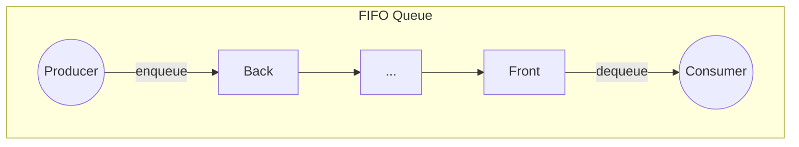

# Stage 1: The Primitive (Basic Queue & Deque)

## Overview
The foundational building blocks of system architecture. These primitives operate in a single-threaded context and focus purely on data flow mechanics (FIFO and Doubly-Ended). 

## Functional Requirements
* **Basic Queue (FIFO):** Must support adding to the back (`enqueue`), removing from the front (`dequeue`), viewing the front (`peek`), and checking state (`is_empty`, `size`).
* **Doubly-Ended Queue (Deque):** Must support bidirectional addition and removal (`push_front`, `push_back`, `pop_front`, `pop_back`) and bidirectional viewing (`peek_front`, `peek_back`).
* **Concurrency:** None. These are strictly single-threaded implementations.

## Non-Functional Requirements (NFRs)
* **Time Complexity:** All core insertions and deletions must strictly execute in **O(1)** time.
* **Memory Efficiency:** Avoid contiguous array shifting overhead. Removing the first element of a standard array causes an **O(N)** shift of all subsequent elements. Under the hood, these must be implemented as doubly-linked lists or dynamically resizing circular arrays.
* **Cache Locality (Trade-off):** Linked-list implementations suffer from poor CPU L1/L2 cache locality due to scattered memory heap allocations. Circular arrays offer better locality but suffer from occasional **O(N)** resizing overhead.

## Key Engineering Concepts 
1. **Safe Nullability (`std::optional` / `Optional`):** Instead of returning dummy values (like `-1`) or risking null pointer exceptions on empty pops, modern implementations use Optionals to safely represent "data or nothing".
2. **Const Correctness:** Read-only accessors (`peek`, `size`, `is_empty`) must be marked `const` to guarantee to the compiler that the internal state remains unmutated.
3. **Pass-by-Const-Reference:** To prevent expensive deep copies of large objects (e.g., 10MB structs) during insertion, payloads must be passed as `const T&`.

## Real-World Use Cases & Applications
* **Basic Queue:** * Level-order traversal (BFS) in trees/graphs.
  * Basic OS Task buffering (e.g., Printer Spooler - first document sent is first printed).
* **Deque:** * Sliding window maximum algorithms.
  * Monotonic queues.
  * Browser History (back and forward buttons).
  * Undo/Redo stacks in text editors where capacity is limited (oldest items fall off the back, newest items push to the front).

## Architecture Diagrams



## Cpp Code
```cpp
#include <queue>
#include <deque>
#include <optional>
#include <iostream>

// ==========================================
// 1. Primitive Queue (FIFO)
// ==========================================
template <typename T>
class PrimitiveQueue {
private:
    std::queue<T> basicQueue;

public:
    // Explicitly generate the highly-optimized default constructor
    PrimitiveQueue() = default; 

    // Pass by const reference to avoid expensive deep copies
    void enqueue(const T& item) {
        basicQueue.push(item);
    }

    // Dequeue modifies the queue, so it is NOT marked const
    std::optional<T> dequeue() {
        if (basicQueue.empty()) {
            return std::nullopt;
        }
        T frontItem = basicQueue.front();
        basicQueue.pop();
        return frontItem; 
    }

    // Return std::optional. Mark as const because it doesn't change state
    std::optional<T> peek() const {
        if (basicQueue.empty()) {
            return std::nullopt;
        }
        return basicQueue.front();
    }

    bool is_empty() const {
        return basicQueue.empty();
    }

    size_t size() const {
        return basicQueue.size();
    }
};

// ==========================================
// 2. Primitive Deque (Doubly-Ended)
// ==========================================
template <typename T>
class DoublyEndedQueue {
private:
    std::deque<T> doublyQue;

public:
    DoublyEndedQueue() = default;

    void pushFront(const T& item) {
        doublyQue.push_front(item);
    }

    void pushBack(const T& item) { 
        doublyQue.push_back(item);
    }

    std::optional<T> popFront() {
        if (doublyQue.empty()) 
            return std::nullopt;
        
        T frontItem = doublyQue.front();
        doublyQue.pop_front();
        return frontItem;
    }

    std::optional<T> popBack() {
        if (doublyQue.empty()) 
            return std::nullopt;
        
        T backItem = doublyQue.back();
        doublyQue.pop_back();
        return backItem;
    }

    std::optional<T> peekFront() const {
        if (doublyQue.empty())
            return std::nullopt;
        
        return doublyQue.front();      
    }

    std::optional<T> peekBack() const {
        if (doublyQue.empty())
            return std::nullopt;
        
        return doublyQue.back();
    }

    bool isEmpty() const {
        return doublyQue.empty();
    }
    
    size_t size() const {
        return doublyQue.size();
    }
};
```

## Python Implementation
```py
from collections import deque
from typing import TypeVar, Generic, Optional

T = TypeVar('T')

# ==========================================
# 1. Primitive Queue (FIFO)
# ==========================================
class PrimitiveQueue(Generic[T]):
    """
    Strict FIFO Queue. Hides the internal collections.deque implementation 
    details to prevent accidental LIFO/Deque operations.
    """
    def __init__(self) -> None:
        self._container: deque[T] = deque()

    def enqueue(self, item: T) -> None:
        self._container.append(item)  # O(1)

    def dequeue(self) -> Optional[T]:
        if self.is_empty():
            return None
        return self._container.popleft()  # O(1)

    def peek(self) -> Optional[T]:
        if self.is_empty():
            return None
        return self._container[0]  # O(1)

    def is_empty(self) -> bool:
        return not self._container
        
    def size(self) -> int:
        return len(self._container)


# ==========================================
# 2. Primitive Deque (Doubly-Ended)
# ==========================================
class PrimitiveDeque(Generic[T]):
    """
    Doubly-Ended Queue exposing strict O(1) operations on both boundaries.
    """
    def __init__(self) -> None:
        self._container: deque[T] = deque()

    def push_front(self, item: T) -> None:
        self._container.appendleft(item) # O(1)

    def push_back(self, item: T) -> None:
        self._container.append(item)     # O(1)

    def pop_front(self) -> Optional[T]:
        if self.is_empty():
            return None
        return self._container.popleft() # O(1)

    def pop_back(self) -> Optional[T]:
        if self.is_empty():
            return None
        return self._container.pop()     # O(1)

    def peek_front(self) -> Optional[T]:
        if self.is_empty():
            return None
        return self._container[0]
        
    def peek_back(self) -> Optional[T]:
        if self.is_empty():
            return None
        return self._container[-1]

    def is_empty(self) -> bool:
        return not self._container
        
    def size(self) -> int:
        return len(self._container)
```
