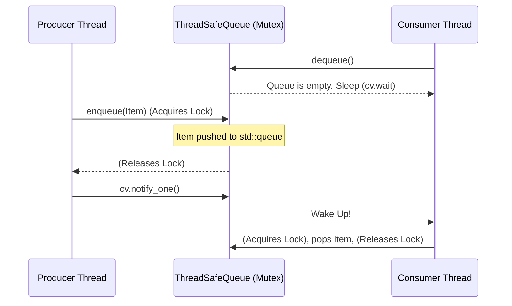

# Stage 2: The Concurrency Shield (Producer-Consumer Queue)

## Overview
A thread-safe queue designed for multi-threaded environments. It ensures that multiple producers can push data, and multiple consumers can pull data simultaneously without causing memory corruption (race conditions) or burning CPU cycles when empty.

## Functional Requirements
* **Thread Safety:** All read and write operations must be mutually exclusive.
* **Blocking Dequeue:** If a consumer attempts to dequeue from an empty queue, the thread must yield execution (sleep) until a producer pushes an item.
* **Unbounded:** The queue can grow infinitely (constrained only by system memory).

## Non-Functional Requirements
* **No CPU Spinning:** Consumers must not use `while(true)` loops to check for data, as this burns 100% of a CPU core. They must use OS-level condition variables to sleep.
* **Avoid Spurious Wakeups:** The system must handle OS-level anomalies where a sleeping thread is woken up without a signal.

## Key Engineering Concepts
1. **`mutable` Mutexes:** Read-only accessors like `size()` must be marked `const`. However, to read safely, they must lock the mutex. In C++, synchronization primitives must be declared `mutable` to allow locking within `const` contexts.
2. **Move Semantics:** When dequeueing, the item must be moved (`std::move`) out of the queue before calling `pop()` to prevent dangling references and avoid expensive deep copies.
3. **Lock Scoping:** Mutexes should be unlocked *before* triggering a Condition Variable notification. Otherwise, the woken thread will immediately block again trying to acquire the still-held lock.

## Architecture Diagram



## Cpp code
```cpp
#include <queue>
#include <mutex>
#include <condition_variable>
#include <iostream>

template <typename T>
class ThreadSafeQueue {
private:
    std::queue<T> q;
    mutable std::mutex mtx; // 'mutable' allows locking inside const methods
    std::condition_variable cv;

public:
    ThreadSafeQueue() = default;

    void enqueue(const T& item) {
        {
            // Lock is scoped to this block
            std::lock_guard<std::mutex> lock(mtx);
            q.push(item);
        } // Lock is released here
        
        // Notify OUTSIDE the lock to prevent consumer thrashing
        cv.notify_one(); 
    }

    T dequeue() {
        std::unique_lock<std::mutex> lock(mtx);
        
        // Lambda prevents spurious wakeups. Thread sleeps until q is not empty.
        cv.wait(lock, [this]() { return !q.empty(); });

        // Safely extract the item using move semantics before popping
        T task = std::move(q.front());
        q.pop();
        
        return task; // RVO (Return Value Optimization) handles this safely
    }

    size_t size() const {
        // Safe to lock because mtx is mutable
        std::lock_guard<std::mutex> lock(mtx);
        return q.size();
    }
};
```

## Python code
Python has a built-in queue.Queue which is already thread-safe. To demonstrate the low-level design parity with C++, this implements the mechanics from scratch using threading.Condition.

```py
import threading
from collections import deque
from typing import TypeVar, Generic

T = TypeVar('T')

class ThreadSafeQueue(Generic[T]):
    def __init__(self) -> None:
        self._container: deque[T] = deque()
        # A Condition encapsulates both a Lock (mutex) and a wait/notify mechanism
        self._condition = threading.Condition()

    def enqueue(self, item: T) -> None:
        with self._condition: # Acquires the underlying lock
            self._container.append(item)
            # Notify wakes up one sleeping consumer thread
            self._condition.notify() 

    def dequeue(self) -> T:
        with self._condition:
            # While loop prevents spurious wakeups (Python's equivalent to the C++ lambda)
            while not self._container:
                self._condition.wait() # Releases lock and sleeps. Re-acquires on wake.
            
            return self._container.popleft()
            
    def size(self) -> int:
        with self._condition:
            return len(self._container)
```
