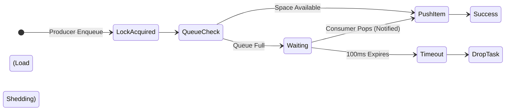

# Stage 3.5: Timeout-Based Backpressure & Load Shedding

## Overview
In high-throughput microservices, blocking a producer thread indefinitely when the queue is full leads to thread-pool exhaustion and cascading system failures. 

To prevent this, we introduce **Timeout-Based Backpressure (Load Shedding)**. If the queue remains full beyond a defined latency budget (e.g., 100ms), the producer abandons the operation. The upstream system can then safely return an error (like HTTP 429 Too Many Requests or 503 Service Unavailable) rather than crashing.

## Key Engineering Concepts
1. **Timeouts (`std::chrono` / `wait_for`):** Instructs the OS scheduler to put the thread to sleep, but guarantees a wake-up after a maximum time limit, preventing indefinite deadlocks.
2. **Enum Return Types over Exceptions:** In high-performance C++, exceptions are extremely slow due to stack unwinding. Expected control-flow variations (like a timeout) should be handled via enums, not `throw` statements.

## Architecture Diagram


## Cpp
```cpp
#include <condition_variable>
#include <queue>
#include <mutex>
#include <chrono>
#include <iostream>

// Strongly typed Enum to avoid expensive C++ exceptions
enum class QueueStatus {
    SUCCESS,
    TIMEOUT,
    CLOSED
};

template <typename T>
class ResilientBoundedQueue {
private:
    mutable std::mutex mtx;
    std::condition_variable not_empty;
    std::condition_variable not_full;
    
    size_t capacity;
    std::queue<T> q;
    bool isFinished;

public:
    explicit ResilientBoundedQueue(size_t n) : capacity(n), isFinished(false) {} 
    
    // ==========================================
    // Enqueue with Timeout (Load Shedding)
    // ==========================================
    QueueStatus enqueue_with_timeout(const T& task, std::chrono::milliseconds timeout) {
        std::unique_lock<std::mutex> lock(mtx);
        
        // wait_for puts the thread to sleep with a TTL.
        // Returns false if the timeout expired without the condition becoming true.
        bool space_available = not_full.wait_for(lock, timeout, [this]() { 
            return (q.size() < capacity) || isFinished; 
        });

        if (isFinished) {
            return QueueStatus::CLOSED; // Queue is shutting down
        }
        
        if (!space_available) {
            return QueueStatus::TIMEOUT; // Extreme congestion: Shed Load!
        }

        q.push(task);
        not_empty.notify_one(); 
        return QueueStatus::SUCCESS;
    }

    // ==========================================
    // Dequeue with Out-Parameter
    // ==========================================
    QueueStatus dequeue(T& out_item) {
        std::unique_lock<std::mutex> lock(mtx);
    
        not_empty.wait(lock, [this]() { 
            return !q.empty() || isFinished; 
        });

        // Drain the queue fully before acknowledging the close
        if (isFinished && q.empty()) {
            return QueueStatus::CLOSED;
        }

        out_item = std::move(q.front()); 
        q.pop();
        
        not_full.notify_one(); 
        return QueueStatus::SUCCESS;
    }

    void stopAll() {
        std::lock_guard<std::mutex> lock(mtx);
        if (isFinished) return;
        
        isFinished = true;
        not_empty.notify_all();
        not_full.notify_all();
    }
};
```
## Python Code
```py
import threading
from collections import deque
from typing import TypeVar, Generic, Tuple
from enum import Enum

T = TypeVar('T')

class QueueStatus(Enum):
    SUCCESS = 1
    TIMEOUT = 2
    CLOSED = 3

class ResilientBoundedQueue(Generic[T]):
    def __init__(self, capacity: int) -> None:
        self.capacity = capacity
        self._container: deque[T] = deque()
        self._condition = threading.Condition()
        self._is_finished = False

    def enqueue_with_timeout(self, item: T, timeout_seconds: float) -> QueueStatus:
        with self._condition:
            # Python's wait() returns True if notified, False if timeout expired
            # We must use a while loop to handle spurious wakeups manually if wait returns True
            while len(self._container) >= self.capacity and not self._is_finished:
                notified = self._condition.wait(timeout=timeout_seconds)
                if not notified:
                    # Timeout expired and condition is still not met
                    return QueueStatus.TIMEOUT

            if self._is_finished:
                return QueueStatus.CLOSED

            self._container.append(item)
            self._condition.notify() 
            return QueueStatus.SUCCESS
```
