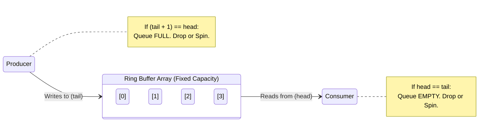

# Stage 4: The High-Performance Engine (Lock-Free Ring Buffer)

## Overview
Standard thread-safe queues rely on Operating System Mutexes and Condition Variables. When a thread hits a lock, the OS suspends it, saves its state, and puts it to sleep. Waking it up takes microseconds. In High-Frequency Trading (HFT), audio streaming, or hyper-scale data ingestion, a microsecond is a missed SLA.

A **Lock-Free Ring Buffer** (Circular Queue) bypasses the OS entirely. It relies on a pre-allocated array and hardware-level atomic operations to achieve nanosecond latency.

---

## 📖 Systems Engineering Reference: Hardware Atomics

To write Lock-Free code, we abandon standard variables and use `std::atomic<T>`. This guarantees that the CPU reads/writes the memory in a single, indivisible hardware step. 

### Table 1: Core `std::atomic` Operations
| Operation | Description |Use Case |
| :--- | :--- | :--- |
| `load()` | Reads the value atomically. | Checking a flag or reading a queue index. |
| `store(val)` | Writes the value atomically. | Updating a queue index after data is written. |
| `fetch_add(n)` | **Hardware Read-Modify-Write (RMW).** Locks the memory bus, adds `n`, and returns the *old* value. | Multi-producer indexing. (Slower than standard load/store). |
| `exchange(val)` | Atomically replaces the current value with `val` and returns the old value. | Thread-safe toggles or replacing pointers. |
| `compare_exchange_weak(expected, new)` | **Compare-And-Swap (CAS).** "Change value to `new`, BUT ONLY IF it currently equals `expected`." | The foundation of all Multi-Producer Lock-Free data structures. |

### Table 2: The C++ Memory Model (`std::memory_order`)
The C++ compiler and the CPU actively reorder your code to make it run faster. In single-threaded code, this is fine. In multi-threaded code, it causes catastrophic bugs (e.g., a Consumer seeing an updated `tail` index *before* the Producer's data is actually written to RAM). We use Memory Orders as "Fences" to stop this reordering.

| Memory Order | The "Fence" Guarantee | Performance |
| :--- | :--- | :--- |
| `relaxed` | **No Fence.** Only guarantees the variable itself is atomic. Code can be reordered freely around it. | ⚡ **Fastest.** Use when reading your *own* thread's index. |
| `release` | **Write Barrier.** Guarantees all preceding code executes *before* this atomic write. | ⏱️ **Fast.** Used by the Producer to publish the `tail`. |
| `acquire` | **Read Barrier.** Guarantees no subsequent code executes *before* this atomic read. | ⏱️ **Fast.** Used by the Consumer to safely read the `tail`. |
| `seq_cst` | **Strict Order.** (Default if unspecified). Forces a global, chronologically perfect order across all threads. | 🐢 **Slowest.** Avoid in HFT queues; it flushes CPU caches. |

---

## Key Engineering Concepts
1. **False Sharing (`alignas(64)`):** CPUs fetch memory in 64-byte chunks (Cache Lines). If `head` and `tail` sit next to each other, the Producer and Consumer will constantly overwrite each other's CPU cache, destroying performance. We pad them to ensure they sit on separate cache lines.
2. **The Chasing Pointers:** To avoid locking a shared `size` variable, the Producer exclusively owns the `write_index` and the Consumer exclusively owns the `read_index`. They safely check each other's positions to determine Full/Empty states.
3. **Power of 2 Bitwise Masking:** The modulo operator (`%`) is computationally expensive (division). By restricting the queue capacity to a power of 2, we use a bitwise AND (`&`) mask for instant circular wrapping (1 CPU cycle vs 15).
4. **The Wasted Slot:** We intentionally leave 1 slot empty in the Ring Buffer. This allows us to definitively distinguish between an completely EMPTY queue (`head == tail`) and a FULL queue (`(tail + 1) % capacity == head`).

## Architecture Diagram



## Cpp Code
```cpp
#include <atomic>
#include <vector>
#include <thread>
#include <stdexcept>
#include <iostream>

template <typename T>
class LockFreeRingBuffer {
private:
    std::vector<T> buffer;
    const size_t capacity;
    const size_t mask;

    // alignas(64) prevents "False Sharing" by ensuring these atomics 
    // sit on completely different CPU Cache Lines.
    alignas(64) std::atomic<size_t> head{0}; // Consumer read index
    alignas(64) std::atomic<size_t> tail{0}; // Producer write index

public:
    // Capacity MUST be a power of 2 (e.g., 1024, 2048) for bitwise masking
    explicit LockFreeRingBuffer(size_t power_of_two_capacity) 
        : capacity(power_of_two_capacity), 
          mask(power_of_two_capacity - 1) {
        
        // Validate power of 2: A binary power of 2 has only one '1' bit.
        if ((capacity & (capacity - 1)) != 0) {
            throw std::invalid_argument("Capacity must be a power of 2");
        }
        buffer.resize(capacity);
    }

    // ==========================================
    // Non-Blocking Enqueue (Fails instantly if full)
    // ==========================================
    bool try_push(const T& item) {
        // relaxed: We own the tail, no need to synchronize reading our own variable
        size_t current_tail = tail.load(std::memory_order_relaxed);
        
        // Bitwise AND circular wrap (equivalent to: (tail + 1) % capacity)
        size_t next_tail = (current_tail + 1) & mask;

        // acquire: Ensure we get the most up-to-date read from the consumer's thread
        if (next_tail == head.load(std::memory_order_acquire)) {
            return false; // Queue is FULL (1 slot is intentionally wasted)
        }

        buffer[current_tail] = item;
        
        // release: Publish the new tail. Guarantees the buffer write happens BEFORE the index updates.
        tail.store(next_tail, std::memory_order_release);
        return true;
    }

    // ==========================================
    // Non-Blocking Dequeue
    // ==========================================
    bool try_pop(T& out_item) {
        // relaxed: We own the head, safe to read without strict fencing
        size_t current_head = head.load(std::memory_order_relaxed);

        // acquire: Ensure we don't read the tail before the producer has finished writing the data
        if (current_head == tail.load(std::memory_order_acquire)) {
            return false; // Queue is EMPTY
        }

        out_item = std::move(buffer[current_head]);
        
        size_t next_head = (current_head + 1) & mask;
        
        // release: Publish the new head so the producer knows space has freed up
        head.store(next_head, std::memory_order_release);
        return true;
    }

    // ==========================================
    // Spin-Wait Enqueue (Burns CPU for lowest latency)
    // ==========================================
    void push_spin(const T& item) {
        while (!try_push(item)) {
            // Optional: Tell the CPU to optimize power usage during a busy-wait spin
            // _mm_pause(); // Intel SSE instruction
        }
    }
};
```

## Python Code
```py
from typing import TypeVar, Generic, Tuple, Optional

T = TypeVar('T')

class LogicalRingBuffer(Generic[T]):
    def __init__(self, power_of_two_capacity: int):
        if (power_of_two_capacity & (power_of_two_capacity - 1)) != 0:
            raise ValueError("Capacity must be a power of 2")
            
        self.capacity = power_of_two_capacity
        self.mask = power_of_two_capacity - 1
        
        # Pre-allocate array
        self.buffer: list[Optional[T]] = [None] * self.capacity
        
        self.head = 0  # Read index
        self.tail = 0  # Write index

    def try_push(self, item: T) -> bool:
        next_tail = (self.tail + 1) & self.mask
        
        if next_tail == self.head:
            return False # FULL (1 slot wasted to distinguish full vs empty)
            
        self.buffer[self.tail] = item
        self.tail = next_tail
        return True

    def try_pop(self) -> Tuple[bool, Optional[T]]:
        if self.head == self.tail:
            return False, None # EMPTY
            
        item = self.buffer[self.head]
        self.buffer[self.head] = None # Help Garbage Collection
        
        self.head = (self.head + 1) & self.mask
        return True, item
```
