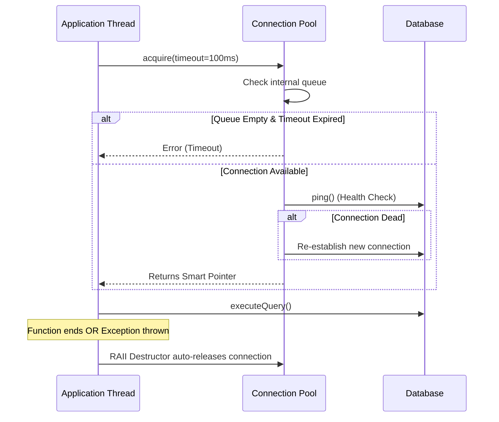

# Stage 6: The Resource Manager (Connection Pool)

## Overview
A Connection Pool is a specialized Bounded Queue. Establishing a database connection requires a TCP 3-way handshake and TLS negotiation, which is extremely slow. Instead of creating and destroying connections per request, we pre-warm a queue of connections and reuse them.

A production-grade pool must handle **Dead Connections** (network drops), **Resource Exhaustion** (timeouts instead of infinite blocking), and **Thread Safety/Exceptions** (returning connections even if the business logic throws an error).

## Key Engineering Concepts
1. **RAII (C++) & Context Managers (Python):** We never trust the client to manually call `pool.release(conn)`. If their code throws an exception, the connection would leak. We wrap the connection in a smart pointer/context manager so it automatically returns to the pool when it goes out of scope.
2. **Liveness Checking (Health Checks):** Before handing a connection to a client, the pool checks if it is still alive. If dead, it dynamically allocates a new one to replace it.
3. **Strict Ownership:** The internal queue uses `std::unique_ptr` to ensure no memory is leaked if the application shuts down abruptly.

## Architecture Diagram



## Cpp 17
```cpp
#include <queue>
#include <mutex>
#include <condition_variable>
#include <memory>
#include <chrono>
#include <iostream>
#include <atomic>

// Dummy Database Connection
class DBConnection {
public:
    int id;
    bool is_connected;

    explicit DBConnection(int i) : id(i), is_connected(true) {
        std::cout << "Established connection ID: " << id << "\n";
    }
    
    // Simulate a health check
    bool ping() const { return is_connected; }
    
    void executeQuery(const std::string& query) { 
        std::cout << "Executing [" << query << "] on conn " << id << "\n"; 
    }
};

class ConnectionPool {
private:
    std::queue<std::unique_ptr<DBConnection>> pool;
    std::mutex mtx;
    std::condition_variable cv;
    std::atomic<int> next_conn_id;

public:
    explicit ConnectionPool(size_t initial_size) : next_conn_id(0) {
        for (size_t i = 0; i < initial_size; ++i) {
            pool.push(std::make_unique<DBConnection>(next_conn_id++));
        }
    }

    // Custom Deleter for std::unique_ptr
    struct PoolDeleter {
        ConnectionPool* pool_ptr;
        void operator()(DBConnection* raw_conn) {
            // Take the raw pointer back, wrap it in a unique_ptr, and return it
            pool_ptr->release(std::unique_ptr<DBConnection>(raw_conn));
        }
    };

    // Alias for clean API usage
    using SmartConnection = std::unique_ptr<DBConnection, PoolDeleter>;

    // Acquire with Timeout and Health Check
    SmartConnection acquire(std::chrono::milliseconds timeout = std::chrono::milliseconds(500)) {
        std::unique_lock<std::mutex> lock(mtx);
        
        bool acquired = cv.wait_for(lock, timeout, [this]() { return !pool.empty(); });
        
        if (!acquired) {
            throw std::runtime_error("Connection Pool Timeout: Downstream saturated.");
        }

        std::unique_ptr<DBConnection> conn = std::move(pool.front());
        pool.pop();

        // Health Check: If the connection died, transparently recreate it
        if (!conn->ping()) {
            std::cout << "Connection " << conn->id << " died. Re-establishing...\n";
            conn = std::make_unique<DBConnection>(next_conn_id++);
        }

        // Release ownership from the standard unique_ptr and give it to our Custom Deleter pointer
        return SmartConnection(conn.release(), PoolDeleter{this});
    }

private:
    // Only accessible via the PoolDeleter
    void release(std::unique_ptr<DBConnection> conn) {
        std::lock_guard<std::mutex> lock(mtx);
        pool.push(std::move(conn));
        cv.notify_one();
    }
};

// ==========================================
// Usage Example (RAII in action)
// ==========================================
void handleRequest(ConnectionPool& pool) {
    try {
        auto conn = pool.acquire(); 
        conn->executeQuery("SELECT * FROM users");
        
        // Simulate a business logic crash
        // throw std::runtime_error("Business logic failed!");
        
    } catch (const std::exception& e) {
        std::cout << "Error: " << e.what() << "\n";
    }
    // No matter what happens (success or crash), 'conn' goes out of scope here.
    // The PoolDeleter automatically returns it to the queue. No leaks!
}
```

## Python Code
```py
import queue
import time
from contextlib import contextmanager
from typing import Generator

class DBConnection:
    def __init__(self, conn_id: int):
        self.conn_id = conn_id
        self.is_connected = True
        
    def ping(self) -> bool:
        return self.is_connected

    def execute_query(self, query: str):
        print(f"Executing [{query}] on conn {self.conn_id}")

class ConnectionPool:
    def __init__(self, size: int):
        # Python's queue.Queue is natively thread-safe (uses Mutex/CV under the hood)
        self._pool: queue.Queue[DBConnection] = queue.Queue(maxsize=size)
        self._next_conn_id = 0
        
        for _ in range(size):
            self._pool.put(self._create_new_connection())

    def _create_new_connection(self) -> DBConnection:
        conn = DBConnection(self._next_conn_id)
        self._next_conn_id += 1
        return conn

    @contextmanager
    def acquire(self, timeout_seconds: float = 0.5) -> Generator[DBConnection, None, None]:
        try:
            # Blocks until a connection is available or timeout occurs
            conn = self._pool.get(timeout=timeout_seconds)
            
            # Health Check
            if not conn.ping():
                print(f"Connection {conn.conn_id} died. Re-establishing...")
                conn = self._create_new_connection()
                
            # Yield the connection to the calling block
            yield conn
            
        except queue.Empty:
            raise TimeoutError("Connection Pool Timeout: Downstream saturated.")
            
        finally:
            # The 'finally' block executes no matter what happens in the caller code
            # (even if exceptions are thrown), guaranteeing the connection returns to the pool.
            if 'conn' in locals():
                self._pool.put(conn)

# ==========================================
# Usage Example (Context Manager in action)
# ==========================================
def handle_request(pool: ConnectionPool):
    try:
        # The 'with' statement triggers the context manager
        with pool.acquire(timeout_seconds=1.0) as conn:
            conn.execute_query("SELECT * FROM users")
            # If an exception happens here, the 'finally' block in acquire() still runs!
            
    except TimeoutError as e:
        print(e)
```
