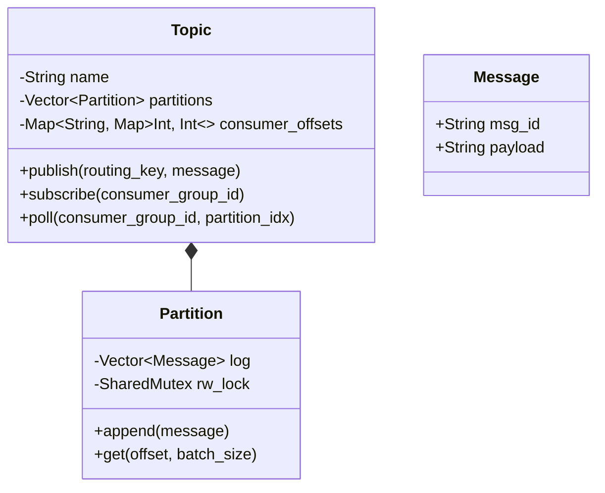

# The Distributed Log (In-Memory Kafka Broker LLD)

## Overview
While standard queues (FIFO) consume and destroy messages upon reading, an Event Broker (like Kafka) acts as an **Immutable Append-Only Log**. Messages are never popped; they are appended. Consumers track their progress using an integer `Offset`. This allows multiple independent microservices to read the exact same stream of events at their own pace without stealing data from each other.

## Key Engineering Concepts
1. **Topic Partitioning:** A Topic is broken down into Partitions. This allows concurrent writing. A routing key is hashed to guarantee that events for the same entity (e.g., `user_id_123`) always land in the same partition, guaranteeing strict chronological ordering for that specific entity.
2. **Reader-Writer Locks (`std::shared_mutex`):** An append-only log has a unique concurrency profile. Multiple consumers should be able to read the log simultaneously without blocking each other. We use a `shared_lock` for readers (concurrent) and a `unique_lock` for the publisher (exclusive).
3. **Consumer Groups & Offsets:** Instead of tracking progress per consumer, we track it per `ConsumerGroupID`. If three consumers belong to "AnalyticsGroup", they share the offsets and distribute the workload (Load Balancing). If "BillingGroup" also subscribes, it gets its own independent set of offsets (Broadcasting).

## Architecture Diagram



## Cpp Code
```cpp
#include <iostream>
#include <string>
#include <vector>
#include <unordered_map>
#include <mutex>
#include <shared_mutex>
#include <memory>
#include <stdexcept>

using namespace std;

struct Message {
    string msg_id;
    string payload;
};

// ==========================================
// 1. Partition (The Append-Only Log)
// ==========================================
class Partition {
private:
    vector<Message> log;
    mutable shared_mutex rw_mtx;

public:
    // Exclusive lock for appending
    void append(const Message& msg) {
        unique_lock<shared_mutex> lock(rw_mtx);
        log.push_back(msg);
    }

    // Shared lock for concurrent reading
    vector<Message> get(size_t offset, size_t batch_size) const {
        shared_lock<shared_mutex> lock(rw_mtx);

        vector<Message> result;
        
        if (offset >= log.size()) {
            return result; // Nothing new to read
        }
        
        size_t end_idx = min(log.size(), offset + batch_size);
        for (size_t i = offset; i < end_idx; ++i) {
            result.push_back(log[i]);
        }
        
        return result;
    }
};

// ==========================================
// 2. Topic (The Router and Offset Manager)
// ==========================================
class Topic {
private:
    int num_partitions;
    vector<unique_ptr<Partition>> partitions;
    
    // consumer_group_id -> (partition_id -> current_offset)
    unordered_map<string, unordered_map<int, size_t>> groups;
    mutex offset_mtx;

public:
    Topic(int nop) : num_partitions(nop) {
        for (int i = 0; i < num_partitions; ++i) {
            partitions.push_back(make_unique<Partition>());
        }
    }

    void publish(const string& routing_key, const Message& msg) {
        // Hash the routing key to guarantee ordering per entity
        int part_index = hash<string>{}(routing_key) % num_partitions;
        partitions[part_index]->append(msg);
    }

    void subscribe(const string& group_name) {
        lock_guard<mutex> lock(offset_mtx);
        
        // If already subscribed, do nothing
        if (groups.find(group_name) != groups.end()) {
            return; 
        }

        // Initialize offsets to 0 for all partitions
        for (int i = 0; i < num_partitions; ++i) {
            groups[group_name][i] = 0;
        }
    }

    vector<Message> poll(const string& consumer_group_id, int partition_idx, int batch_size = 10) {
        size_t current_offset = 0;

        // 1. Safely retrieve the current offset
        {
            lock_guard<mutex> lock(offset_mtx);
            if (groups.find(consumer_group_id) == groups.end()) {
                throw runtime_error("Consumer Group not subscribed!");
            }
            current_offset = groups[consumer_group_id][partition_idx];
        }

        // 2. Read from the specific partition (Uses Shared Lock internally)
        vector<Message> messages = partitions[partition_idx]->get(current_offset, batch_size);

        // 3. Advance the offset bookmark safely
        if (!messages.empty()) {
            lock_guard<mutex> lock(offset_mtx);
            groups[consumer_group_id][partition_idx] += messages.size();
        }

        return messages;
    }
};
```

## Python Code
```py
import threading
from typing import List, Dict

class Message:
    def __init__(self, msg_id: str, payload: str):
        self.msg_id = msg_id
        self.payload = payload

class Partition:
    def __init__(self):
        self.log: List[Message] = []
        self.lock = threading.Lock()

    def append(self, msg: Message):
        with self.lock:
            self.log.append(msg)

    def get(self, offset: int, batch_size: int) -> List[Message]:
        with self.lock:
            if offset >= len(self.log):
                return []
            
            end_idx = min(len(self.log), offset + batch_size)
            return self.log[offset:end_idx]

class Topic:
    def __init__(self, num_partitions: int):
        self.num_partitions = num_partitions
        self.partitions = [Partition() for _ in range(num_partitions)]
        
        # consumer_group_id -> (partition_id -> current_offset)
        self.groups: Dict[str, Dict[int, int]] = {}
        self.offset_lock = threading.Lock()

    def publish(self, routing_key: str, msg: Message):
        part_index = hash(routing_key) % self.num_partitions
        self.partitions[part_index].append(msg)

    def subscribe(self, group_name: str):
        with self.offset_lock:
            if group_name not in self.groups:
                self.groups[group_name] = {i: 0 for i in range(self.num_partitions)}

    def poll(self, consumer_group_id: str, partition_idx: int, batch_size: int = 10) -> List[Message]:
        # 1. Safely retrieve the current offset
        with self.offset_lock:
            if consumer_group_id not in self.groups:
                raise ValueError("Consumer Group not subscribed!")
            current_offset = self.groups[consumer_group_id][partition_idx]

        # 2. Read from partition
        messages = self.partitions[partition_idx].get(current_offset, batch_size)

        # 3. Advance the offset bookmark safely
        if messages:
            with self.offset_lock:
                self.groups[consumer_group_id][partition_idx] += len(messages)

        return messages
```
