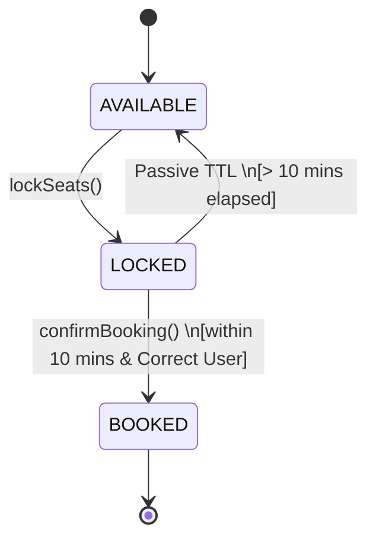

# The Booking Engine (Movie Ticket LLD)

## Overview
A Movie Ticket Booking system (like BookMyShow or Fandango) is fundamentally a test of **Database Isolation, Concurrency Control, and State Machines**. It is not a CRUD application. The system must guarantee strict consistency (no double bookings) while maintaining high read throughput for users browsing seat layouts.

## 1. Scope Boundary
### Functional Requirements (Core 3)
* **Discovery:** Users can search for shows by city and movie.
* **Seat Selection:** Users can lock seats temporarily (TTL) while completing payment.
* **Booking Confirmation:** System confirms the booking if payment succeeds within the TTL.

### Non-Functional Requirements (NFRs)
* **Strict Consistency:** Absolute guarantee against double-booking a single seat.
* **Fault Tolerance (Self-Healing):** Locks must automatically expire if the user abandons the checkout process.
* **Performance:** Read operations (checking availability) must not be blocked by write operations (locking).

### Out of Scope
* Authentication, Payment Gateway integration, Dynamic Pricing, Recommendation Engines.

## 2. Data Flow & Architectural Strategy
* **Read Path (High Traffic):** Users searching for shows or viewing seating charts. In production, this is served heavily from a Distributed Cache (Redis).
* **Write Path (High Contention):** Users locking seats. Bypasses the cache and hits the primary database with an exclusive transaction.

## 3. Key Engineering Concepts
1. **The Concurrency Shield (Mutex Scope):** We do not lock individual seats. If User A wants seats [A1, A2, A3], locking them individually risks deadlocks. We place the `std::mutex` at the **Show** level, serializing all booking attempts for that specific theater screen.
2. **Security against IDOR:** The `Seat` must track `locked_by_user_id`. Without this, User B could call the `confirmBooking` API on a seat locked by User A, effectively stealing the reservation.
3. **Passive TTL (Lazy Expiration):** Instead of running a CPU-heavy background thread to constantly check for 10-minute expirations, we evaluate the TTL *lazily*. A seat is considered available if its status is `LOCKED` but `current_time > lock_timestamp + 10_minutes`. 
4. **Time Injection (Testability):** We pass `current_time_sec` into the APIs rather than calling `now()` internally. This allows unit tests to simulate the passing of 10 minutes instantly.
5. **Unit of Work Pattern (All-or-Nothing):** The booking logic is split into Phase 1 (Verification) and Phase 2 (Mutation). If even one seat in the requested batch is unavailable, the entire transaction aborts before any state is mutated.

## 4. Seat Lifecycle State Machine


## 5 Code
```cpp
#include <iostream>
#include <string>
#include <unordered_map>
#include <vector>
#include <mutex>
#include <memory>

using namespace std;

// ==========================================
// Entities & State
// ==========================================
enum class SeatStatus { AVAILABLE, LOCKED, BOOKED };

struct Seat {
    string seat_id;
    SeatStatus status = SeatStatus::AVAILABLE;
    
    // TTL and Security
    long long lock_timestamp = 0; 
    string locked_by_user_id = ""; 
};

struct Movie {
    string movie_id;
    string title;
};

struct Theater {
    string theater_id;
    string city;
};

class Show {
public:
    string show_id;
    string movie_id;
    string theater_id;
    long long start_time_sec;
    
    unordered_map<string, Seat> seats;
    
    // The Concurrency Shield: Lock at the Show level to prevent multi-seat deadlocks
    mutable mutex show_mtx; 

    Show(string s_id, string m_id, string t_id, long long start) 
        : show_id(s_id), movie_id(m_id), theater_id(t_id), start_time_sec(start) {
        
        // Pre-populate layout
        for (int i = 1; i <= 100; ++i) {
            string seat_id = "S" + to_string(i);
            seats[seat_id] = Seat{seat_id, SeatStatus::AVAILABLE, 0, ""};
        }
    }
};

// ==========================================
// The Booking Engine
// ==========================================
class TicketBookingSystem {
private:
    unordered_map<string, Movie> movies;
    unordered_map<string, Theater> theaters;
    unordered_map<string, shared_ptr<Show>> shows;

    // Search Indexes (O(1) lookups instead of DB Queries)
    unordered_map<string, vector<shared_ptr<Show>>> shows_by_city;

public:
    // ------------------------------------------
    // API 1: Discovery
    // ------------------------------------------
    vector<shared_ptr<Show>> searchShows(const string& city, const string& movie_id, long long current_time_sec) {
        vector<shared_ptr<Show>> result;
        
        // Edge Case: City doesn't exist
        if (shows_by_city.find(city) == shows_by_city.end()) return result;

        for (const auto& show : shows_by_city[city]) {
            // Filter by movie AND ensure the show hasn't already started
            if (show->movie_id == movie_id && show->start_time_sec > current_time_sec) {
                result.push_back(show);
            }
        }
        return result;
    }

    // ------------------------------------------
    // API 2: Lock Seats (The Critical Section)
    // ------------------------------------------
    bool lockSeats(const string& show_id, const vector<string>& seat_ids, const string& user_id, long long current_time_sec) {
        // Optimization: Iterator capture avoids double-lookup in the hash map
        auto it = shows.find(show_id);
        if (it == shows.end()) return false;
        
        shared_ptr<Show> show = it->second;
        long long lock_timeout_sec = 600; // 10 minute TTL

        {
            lock_guard<mutex> lock(show->show_mtx);
            
            // Phase 1: Unit of Work Verification (All-or-Nothing)
            for (const auto& s_id : seat_ids) {
                // Edge case: Seat doesn't exist in this show
                if (show->seats.find(s_id) == show->seats.end()) return false; 
                
                Seat& seat = show->seats[s_id]; 
                
                // Passive TTL Evaluation
                bool is_truly_available = (seat.status == SeatStatus::AVAILABLE) || 
                                          (seat.status == SeatStatus::LOCKED && 
                                          (current_time_sec - seat.lock_timestamp > lock_timeout_sec));
                
                if (!is_truly_available) {
                    return false; // Transaction aborted, someone holds a valid lock
                }
            }
            
            // Phase 2: Mutate State
            for (const auto& s_id : seat_ids) {
                show->seats[s_id].status = SeatStatus::LOCKED;
                show->seats[s_id].lock_timestamp = current_time_sec;
                show->seats[s_id].locked_by_user_id = user_id; // Secure the lock ownership
            }
            return true;
        }
    }

    // ------------------------------------------
    // API 3: Confirm Booking
    // ------------------------------------------
    bool confirmBooking(const string& show_id, const vector<string>& seat_ids, const string& user_id, long long current_time_sec) {
        auto it = shows.find(show_id);
        if (it == shows.end()) return false;
        
        shared_ptr<Show> show = it->second;
        long long lock_timeout_sec = 600;

        {
            lock_guard<mutex> lock(show->show_mtx);
            
            // Phase 1: Verify Ownership and Lock Validity
            for (const auto& s_id : seat_ids) {
                if (show->seats.find(s_id) == show->seats.end()) return false;
                
                Seat& seat = show->seats[s_id];
                
                // IDOR Prevention: Ensure the user confirming is the user who locked it
                if (seat.status != SeatStatus::LOCKED || 
                    seat.locked_by_user_id != user_id || 
                    (current_time_sec - seat.lock_timestamp > lock_timeout_sec)) {
                    return false;
                }
            }
            
            // Phase 2: Confirm
            for (const auto& s_id : seat_ids) {
                show->seats[s_id].status = SeatStatus::BOOKED;
            }
            return true;
        }
    }
};
```
