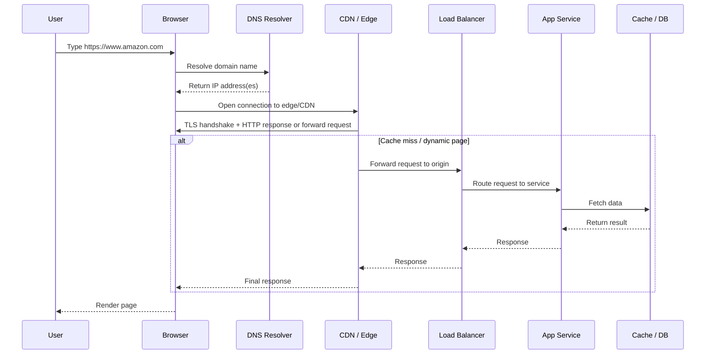
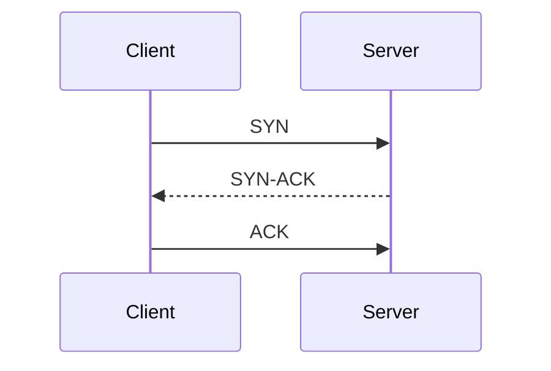

# Chapter 1 — Network Primitives & The Life of a Request

> This chapter builds the mental model for how distributed systems actually talk. Before discussing queues, caches, consensus, or large-scale architectures, we need to understand the plumbing: layers, protocols, request flow, connection semantics, and the trade-offs behind common communication choices.

---

## Why this chapter matters

A surprising number of system design decisions are really networking decisions in disguise.

When you choose **WebSocket vs HTTP**, **gRPC vs REST**, **TCP vs UDP**, or **CDN vs direct origin**, you are choosing among trade-offs in latency, reliability, connection lifecycle, ordering, bandwidth efficiency, and operational complexity.

This chapter gives a first-principles foundation for later topics like real-time systems, API design, service-to-service communication, voice streaming, and LLM response delivery.

---

## What this chapter covers

- OSI model vs TCP/IP model
- How a request flows through the internet when you type a domain like `amazon.com`
- Core protocols across layers
- TCP vs UDP
- Application-layer communication options: HTTP, HTTPS, REST, GraphQL, gRPC, SSE, WebSocket, WebRTC
- How to think about protocol choice in real systems
- Where these concepts show up in large production systems

---

# 1. Networking as layered abstraction

Networking is hard because many different problems must be solved at once:

- how machines identify each other
- how bytes move over a medium
- how packets are routed
- how delivery is made reliable or unreliable
- how applications format and interpret messages
- how connections are secured

Instead of solving everything in one giant protocol, networking is split into **layers**. Each layer has a clear responsibility and hides some lower-level complexity.

That is the core idea behind both **OSI** and **TCP/IP**.

---

## 1.1 OSI model

The **OSI model** is a conceptual 7-layer model used mostly for learning, reasoning, and debugging.

| Layer | Name | What it does | Common examples |
|---|---|---|---|
| 7 | Application | What the app uses directly | HTTP, HTTPS, DNS, WebSocket, gRPC |
| 6 | Presentation | Data format, encoding, encryption representation | TLS concepts, JSON, Protobuf, compression |
| 5 | Session | Connection/session coordination | Session management, RPC session semantics |
| 4 | Transport | End-to-end delivery between processes | TCP, UDP |
| 3 | Network | Routing across networks | IP, ICMP |
| 2 | Data Link | Delivery inside local network segment | Ethernet, Wi-Fi MAC, ARP |
| 1 | Physical | Actual signal transmission | Copper, fiber, radio |

### Important note

In practice, people do **not** always separate Presentation and Session cleanly. They are useful conceptually, but many modern protocol stacks merge them into higher layers.

---

## 1.2 TCP/IP model

The **TCP/IP model** is closer to how the internet is actually built and discussed in engineering.

| TCP/IP Layer | Rough OSI Mapping | What it does | Examples |
|---|---|---|---|
| Application | OSI 5, 6, 7 | Application protocols and data semantics | HTTP, DNS, TLS, gRPC, WebSocket |
| Transport | OSI 4 | Process-to-process communication | TCP, UDP |
| Internet | OSI 3 | Packet routing across networks | IP |
| Link / Network Access | OSI 1, 2 | Local network delivery | Ethernet, Wi-Fi, ARP |

### Why TCP/IP matters more in real systems

Because actual production systems are usually reasoned about in terms like:

- application protocol
- transport choice
- IP routing
- local network behavior

You will almost never hear an engineer say, “This is a layer 5 issue” in a design review. You *will* hear:

- this is a DNS problem
- this is a TCP connection problem
- this is a TLS handshake overhead issue
- this is an application protocol mismatch

So:

- **OSI is the better teaching model**
- **TCP/IP is the more practical engineering model**

---

## 1.3 OSI vs TCP/IP — what is the actual difference?

| Dimension | OSI | TCP/IP |
|---|---|---|
| Nature | Reference model | Practical internet model |
| Number of layers | 7 | 4 (sometimes 5 in some explanations) |
| Goal | Standard conceptual separation | Real-world protocol suite and implementation thinking |
| Usage today | Education, debugging, abstraction | Actual system/network design discussions |
| Session / Presentation layers | Separate | Usually folded into Application |

### Interview-friendly summary

**OSI helps you think. TCP/IP helps you build.**

---

# 2. How a request flows through the internet when you type `amazon.com`

This is one of the best exercises for building true system intuition.

When a user types `https://www.amazon.com` into the browser, a lot happens before the page appears.

---

## 2.1 High-level flow



---

## 2.2 Step-by-step breakdown

### Step 1: URL parsing

The browser first understands:

- protocol: `https`
- host: `www.amazon.com`
- optional path/query/fragment

Because the scheme is **HTTPS**, the browser knows it must create a secure connection before exchanging application data.

---

### Step 2: DNS resolution

Humans use names like `amazon.com`; networks route using IP addresses.

So the browser must resolve the domain to an IP address.

Typical DNS path:

1. browser cache
2. OS cache
3. local resolver / ISP / enterprise resolver
4. recursive DNS lookup if needed
5. result returned with TTL

### Why DNS matters in system design

DNS is not just name mapping. It is also used for:

- geo-routing
- failover
- traffic steering
- CDN edge mapping
- service indirection

For large companies, DNS is often the **first traffic control point**.

---

### Step 3: Establishing the connection

Depending on the protocol stack, the client may do some combination of:

- TCP handshake
- TLS handshake
- HTTP negotiation

For traditional **HTTPS over TCP**, the path is roughly:

1. TCP 3-way handshake
2. TLS handshake
3. HTTP request sent over secure channel

#### TCP 3-way handshake



This establishes a connection with agreed sequence numbers and connection state.

---

### Step 4: TLS handshake

TLS provides:

- server authentication
- encryption
- integrity protection
- optional client authentication in some systems

In practice, TLS is fundamental for:

- customer security
- credential protection
- API security
- privacy
- compliance

Without TLS, the network path can inspect or tamper with traffic much more easily.

---

### Step 5: Sending the HTTP request

The browser sends something conceptually like:

```http
GET / HTTP/1.1
Host: www.amazon.com
User-Agent: BrowserName/Version
Accept: text/html
Cookie: ...
```

At this point, the request may terminate first at:

- CDN edge
- reverse proxy
- WAF
- API gateway
- load balancer

and only then move toward application servers.

---

### Step 6: CDN / edge processing

Large internet services rarely serve everything directly from origin.

An edge layer may:

- terminate TLS
- cache static assets
- block malicious traffic
- compress responses
- rewrite headers
- route to regional backends

For a product page, some parts may come from cache while dynamic content may come from origin services.

---

### Step 7: Load balancer and backend services

The request reaches a load balancer which distributes it across healthy backend instances.

Backends may then call:

- authentication service
- catalog service
- pricing service
- recommendations service
- inventory service
- cache
- database

This is where “one web page” becomes a **distributed system**.

---

### Step 8: Response path back to browser

The response goes back through the reverse path:

- app server
- load balancer
- CDN/edge
- browser

The browser then:

- parses HTML
- discovers referenced JS/CSS/images
- sends additional requests
- renders the page
- runs client-side logic

So the visible page is usually the result of **many requests, not one**.

---

## 2.3 Real-world production observations

When people casually say, “The website is slow,” the actual bottleneck could be anywhere in this chain:

- DNS latency
- TCP/TLS setup overhead
- CDN miss
- overloaded load balancer
- slow backend service
- cache miss
- database contention
- large payload size
- client-side rendering delay

That is why performance debugging in distributed systems is almost never just an “application code” problem.

---

# 3. Core protocols by layer

This section builds a practical mapping from layer to protocols you will repeatedly encounter.

---

## 3.1 Link layer examples

This is about moving frames within a local network segment.

Common examples:

- Ethernet
- Wi-Fi
- ARP (address resolution in local context)

Most application engineers do not directly design at this layer, but it matters for:

- local network troubleshooting
- device environments
- embedded and IoT systems
- packet capture analysis

### Where it matters in smart device ecosystems

In device-heavy environments, local connectivity problems often show up here first:

- Wi-Fi instability
- ARP resolution issues
- local subnet problems
- NIC / radio-level retries

---

## 3.2 Internet layer

The internet layer is responsible for routing packets across networks.

Common examples:

- IPv4 / IPv6
- ICMP

### Key idea

IP provides addressing and routing, but **not reliable ordered delivery** by itself.

That reliability question is handled by the transport layer.

---

## 3.3 Transport layer

The transport layer decides how two endpoints exchange data between processes.

The big decision here is often:

- **TCP**
- **UDP**

---

# 4. TCP vs UDP

This is one of the most important early distinctions in system design.

## 4.1 TCP

TCP is **connection-oriented** and provides:

- reliable delivery
- ordered delivery
- retransmission
- flow control
- congestion control

### Why TCP is popular

Most application developers do not want to reimplement:

- missing packet recovery
- packet reordering
- congestion safety
- delivery semantics

TCP gives a strong default abstraction: **a reliable ordered byte stream**.

### Common use cases

- HTTP / HTTPS
- REST APIs
- gRPC over HTTP/2
- database connections
- WebSockets (commonly over TCP)

### Trade-offs

Because TCP guarantees reliability and ordering, it can add:

- handshake overhead
- retransmission latency
- head-of-line blocking in some cases
- more connection state

---

## 4.2 UDP

UDP is **connectionless** and much lighter.

It does **not** guarantee:

- delivery
- ordering
- retransmission
- congestion handling like TCP

That sounds dangerous, but it is extremely useful when:

- low latency matters more than perfect reliability
- the application can tolerate some loss
- the application itself manages recovery logic

### Common use cases

- DNS queries
- voice/media streaming
- online gaming
- telemetry bursts
- QUIC transport foundations
- parts of WebRTC media paths

### Trade-offs

With UDP, the application often has to think more about:

- loss handling
- ordering
- jitter
- timing
- security and abuse prevention

---

## 4.3 TCP vs UDP comparison

| Dimension | TCP | UDP |
|---|---|---|
| Connection model | Connection-oriented | Connectionless |
| Reliability | Yes | No built-in guarantee |
| Ordering | Yes | No built-in guarantee |
| Retransmission | Yes | No |
| Latency overhead | Higher | Lower |
| Statefulness | Higher | Lower |
| Best for | Correctness-heavy request/response | Latency-sensitive traffic |

### Practical summary

Use **TCP** when correctness and simplicity matter more. Use **UDP** when low-latency delivery matters and the application can tolerate or manage loss.

---

## 4.4 Real-world mapping

### In web backends

Almost everything starts with TCP because APIs care deeply about correctness and reliability.

### In voice/video systems

Media is often more tolerant of a lost packet than a delayed packet. A packet arriving too late may be useless anyway. That is one reason real-time media often favors UDP-based approaches.

### In Alexa-like or smart device contexts

- control-plane commands often value correctness and may use TCP-friendly protocols
- media and real-time audio/video paths often optimize aggressively for latency and may use UDP-based mechanisms in parts of the stack

### In LLM systems

UI token streaming to browsers is usually built on TCP-backed application protocols because correctness, browser compatibility, and infrastructure simplicity matter more than shaving every last millisecond.

---

# 5. Application-layer protocols and communication styles

Now we move closer to what system designers choose directly.

These are the protocols and patterns that application teams actually debate in design reviews.

---

## 5.1 HTTP

HTTP is the foundational request-response protocol of the web.

### Core idea

A client sends a request; a server returns a response.

### Why it won

- simple mental model
- works well across networks and proxies
- broad tooling support
- easy debugging
- browser/native support
- maps naturally to APIs

### Common usage

- web pages
- REST APIs
- internal control APIs
- service-to-service communication

---

## 5.2 HTTPS

HTTPS is simply **HTTP over TLS**.

That means:

- the HTTP semantics remain
- transport is protected using TLS

### Why HTTPS is non-negotiable now

Because modern systems need:

- privacy
- credential protection
- tamper resistance
- trust
- compliance

In practice, any internet-facing system without HTTPS is treated as broken or unacceptable.

---

## 5.3 REST

REST is not a wire protocol; it is an **architectural style** usually implemented over HTTP.

### Typical characteristics

- resource-oriented URLs
- standard HTTP verbs like GET, POST, PUT, DELETE
- stateless request handling
- JSON payloads are common

### Why teams like REST

- simple to understand
- easy for external consumers
- human-readable
- broad ecosystem support

### Where REST fits best

- public APIs
- CRUD-heavy systems
- simple mobile/backend APIs
- integration surfaces with many consumers

### Weak spots

- can become over-chatty
- under-fetching or over-fetching depending on endpoint design
- not ideal for every realtime or strongly typed service-to-service use case

---

## 5.4 GraphQL

GraphQL lets clients ask for exactly the fields they need.

### Why it exists

Because REST endpoints can force clients into:

- fetching too much data
- making many round trips
- dealing with rigid resource boundaries

### Strengths

- client-controlled shape of response
- good for complex frontend data needs
- reduces over-fetching

### Trade-offs

- added query complexity
- harder caching story in some setups
- harder server-side cost control
- requires careful schema governance

### Good use cases

- frontend aggregation layers
- apps with variable UI data needs
- many clients needing different slices of related data

---

## 5.5 gRPC

gRPC is an RPC framework typically built on **HTTP/2** and **Protocol Buffers**.

### Why engineers choose gRPC

- efficient binary serialization
- strongly typed contracts
- good code generation
- streaming support
- efficient internal service-to-service communication

### Best fit

- internal microservices
- latency-sensitive backend communication
- polyglot service environments with schema discipline

### Trade-offs

- less browser-native than plain REST
- debugging can feel less transparent than JSON/HTTP
- external third-party consumers may prefer simpler REST APIs

### Real-world mapping

At large companies, a common pattern is:

- **public-facing APIs**: REST/JSON
- **internal service mesh / backend communication**: gRPC

---

## 5.6 SSE (Server-Sent Events)

SSE allows the server to push a stream of events to the client over HTTP.

### Key property

- server → client streaming only
- simpler than full-duplex WebSocket for some use cases

### Good fit

- status streams
- dashboards
- token streaming to browser clients
- progress updates

### Trade-offs

- not full bidirectional communication
- less flexible than WebSocket for two-way interactive systems

---

## 5.7 WebSocket

WebSocket provides a long-lived, bidirectional communication channel over a single connection.

### Why it exists

Repeated request-response polling is inefficient when both sides need to talk continuously.

### Good fit

- chat
- collaboration
- presence
- game signaling
- realtime dashboards
- bidirectional agent or device session updates

### Trade-offs

- more connection lifecycle management
- heartbeats and liveness become important
- reconnect storms must be handled
- load balancing / shared session state can get tricky

> Chapter 2 will go deeper into WebSocket, SSE, polling, and realtime design choices.

---

## 5.8 WebRTC

WebRTC is designed for real-time peer/media communication, especially audio, video, and interactive data channels.

### Why it matters

For browser-based real-time communication, WebRTC solves much more than “send bytes.” It also addresses:

- NAT traversal
- media transport
- low-latency delivery
- peer connection establishment

### Common usage

- voice/video calling
- live communication
- browser-based meetings
- low-latency interactive streams

### Trade-offs

- much more complex than HTTP APIs
- signaling setup is non-trivial
- operational debugging is harder

---

## 5.9 Quick comparison table

| Option | Primary model | Direction | Best for | Weakness |
|---|---|---|---|---|
| REST/HTTP | Request-response | Client ↔ Server per request | Simple APIs, public interfaces | Can be chatty |
| GraphQL | Flexible query API | Request-response | Frontend data composition | Operational complexity |
| gRPC | RPC over HTTP/2 | Unary + streaming | Internal services | Browser/public API friction |
| SSE | Server push stream | Server → Client | Live updates, token streaming | Not bidirectional |
| WebSocket | Persistent full-duplex | Client ↔ Server | Interactive realtime | Stateful connection complexity |
| WebRTC | Realtime peer/media | Peer/media oriented | Audio/video/interactive media | More complex setup |

---

# 6. How to choose the right protocol in practice

This is where system design becomes engineering judgment.

Do **not** choose protocols by trend. Choose them by problem shape.

---

## 6.1 A practical decision framework

Ask these questions:

1. Is this request-response or continuous streaming?
2. Is communication one-way or bidirectional?
3. How much latency sensitivity is there?
4. Can the application tolerate packet loss?
5. Is browser support important?
6. Is the interface public-facing or internal-only?
7. Do we need strong typing and schema contracts?
8. Are we optimizing for simplicity or peak efficiency?

---

## 6.2 Rule-of-thumb choices

| Situation | Usually a good first choice |
|---|---|
| Public CRUD API | REST |
| Frontend needs flexible aggregate reads | GraphQL |
| Internal service-to-service RPC | gRPC |
| Server streaming updates to browser | SSE |
| Interactive bidirectional realtime app | WebSocket |
| Voice/video calling or low-latency media | WebRTC |

---

# 7. Production mapping: where this shows up in real systems

This section is what turns networking notes into engineering notes.

---

## 7.1 E-commerce platform like Amazon

When a user opens a product page:

- DNS routes the request toward the right edge
- HTTPS secures the channel
- CDN serves cacheable assets
- load balancers distribute requests
- multiple backend services assemble page data
- internal services may use gRPC or other internal RPC patterns

Even a “simple page load” is a layered networking story.

---

## 7.2 Alexa / voice-assistant style systems

A voice ecosystem is not just one request-response pair. It usually involves:

- device connectivity
- control-plane communication
- service-to-service APIs
- low-latency orchestration
- sometimes media/control separation
- state sync across devices or services

Examples of where concepts from this chapter matter:

- **TCP-backed APIs** for device registration, capability sync, settings, and control actions
- **HTTPS** for secure communication with cloud services
- **gRPC/internal RPC** for backend microservice interactions
- **WebSocket/SSE-like models** for push-oriented state or event delivery in some interactive workflows
- **UDP-oriented ideas** in low-latency media systems where delayed packets are less useful than dropped packets

### Engineering takeaway

In voice systems, “realtime” often means separating:

- control path correctness
- media path latency

That design separation appears repeatedly in production architectures.

---

## 7.3 LLM / AI product systems

In LLM-backed systems, networking choices affect perceived intelligence.

Why? Because the user experiences:

- time to first token
- smoothness of token stream
- latency of tool calls
- progress visibility
- interruption/cancellation behavior

Examples:

- **REST** for standard inference request endpoints
- **SSE** for browser token streaming
- **WebSocket** for agent state, tool execution events, or bidirectional session behavior
- **gRPC** for efficient internal model-serving or service-to-service calls

### Engineering takeaway

A large part of “this AI feels fast” is actually good streaming and transport design.

---

## 7.4 Realtime collaboration and chat

Realtime systems often need:

- persistent user presence
- low-latency delivery
- fanout to many clients
- session liveness detection

That is why they frequently use:

- WebSocket for bidirectional interaction
- pub/sub behind the scenes for fanout
- sticky sessions or shared state infrastructure

---

# 8. Common failure modes and debugging instincts

This chapter becomes truly useful when you connect concepts to failure cases.

---

## 8.1 DNS-related problems

Symptoms:

- intermittent failures
- some users failing while others work
- regional differences
- stale routing after failover

Think about:

- TTL
- resolver cache
- propagation delays
- split-horizon DNS

---

## 8.2 TCP/TLS setup overhead

Symptoms:

- high latency before first byte
- mobile/network-sensitive slow starts
- short-lived connection inefficiency

Think about:

- connection reuse
- keep-alive
- HTTP/2 multiplexing
- TLS session resumption

---

## 8.3 Wrong protocol choice

Symptoms:

- polling overload
- chatty APIs
- too many round trips
- poor browser compatibility
- stateful realtime system becoming hard to scale

Think about:

- whether this is actually request-response
- whether server push is needed
- whether full duplex is necessary
- whether internal and external APIs should differ

---

## 8.4 Load balancer / connection-state issues

Symptoms:

- WebSocket drops after deploys
- reconnect storms
- sticky session imbalance
- stale backend affinity

Think about:

- heartbeat strategy
- shared session state vs sticky routing
- graceful draining during deploys
- backoff with jitter on reconnect

---

# 9. A small code snippet to connect theory with practice

Sometimes the fastest way to make networking real is to look at a minimal program.

## 9.1 Simple Python TCP client example

```python
import socket

HOST = "example.com"
PORT = 80

with socket.create_connection((HOST, PORT)) as s:
    request = (
        "GET / HTTP/1.1\r\n"
        "Host: example.com\r\n"
        "Connection: close\r\n\r\n"
    )
    s.sendall(request.encode())

    response = b""
    while True:
        chunk = s.recv(4096)
        if not chunk:
            break
        response += chunk

print(response.decode(errors="ignore"))
```

### What this demonstrates

- opening a TCP connection
- sending an HTTP request over it
- reading the byte stream response

This is obviously simplified, but it shows that many high-level web interactions eventually become: **open connection → send bytes → receive bytes**.

---

# 10. Interview angle

In interviews, networking knowledge is valuable when used with judgment, not when recited like a textbook.

A strong answer sounds like this:

- start from the communication pattern
- identify traffic direction and latency needs
- choose protocol based on system constraints
- mention operational consequences
- explain why alternatives are weaker for that scenario

### Example

Instead of saying:

> We can use WebSocket because it is realtime.

Say:

> We need the server to push state changes to clients with low latency and the client may also send acknowledgements or interaction events, so a persistent bidirectional channel is a better fit than polling or SSE. The trade-off is connection lifecycle complexity, so we need heartbeat, reconnect backoff, and a scaling strategy for stateful connections.

That is the difference between surface knowledge and design thinking.

---

# 11. Key takeaways

- OSI is a conceptual learning model; TCP/IP is the more practical engineering model.
- Internet systems are layered because different networking problems need separate abstractions.
- A browser request to a domain like `amazon.com` involves DNS, connection setup, TLS, edge routing, load balancing, backend services, and rendering.
- IP handles routing; transport protocols handle delivery behavior.
- TCP prioritizes reliable ordered delivery; UDP prioritizes lighter-weight low-latency communication.
- HTTP/HTTPS, REST, GraphQL, gRPC, SSE, WebSocket, and WebRTC solve different communication shapes.
- Protocol choice should be driven by traffic pattern, latency sensitivity, reliability needs, and operational complexity.
- In real systems, many performance and reliability problems are actually networking problems in disguise.

---

# 12. Related topics

This chapter connects naturally to:

- **Chapter 2 — Real-Time Updates**
  - polling
  - long polling
  - SSE
  - WebSocket
  - WebRTC
  - server push vs bidirectional communication
- **Chapter 3 — API Design**
  - why APIs exist
  - public vs internal interfaces
  - REST design
  - GraphQL schema design
  - gRPC contracts
- load balancing
- caching
- retries and backoff
- service discovery
- observability and tracing
- CDN and edge architecture

---

# 13. Recommended resources

## Foundational reading

- *Computer Networking: A Top-Down Approach* — Kurose & Ross
- MDN docs for HTTP, WebSocket, SSE, WebRTC
- Cloudflare learning resources on DNS, TLS, HTTP, CDN, and networking
- Google SRE book sections related to latency, RPC, and production systems

## Practical documentation

- HTTP documentation and RFC summaries
- gRPC official documentation
- WebRTC official guides
- browser networking docs for HTTPS, HTTP/2, connection reuse, and caching

## What to focus on next

From here, the most natural next step is:

1. request-response vs server push
2. polling vs long polling vs SSE vs WebSocket
3. realtime connection state and scaling
4. how API style changes system shape

---

# 14. Final mental model

A useful way to remember this chapter:

> System design starts before databases, queues, and caching. It starts the moment one machine needs to talk to another machine correctly, securely, and efficiently.

That is why networking primitives are not background theory. They are the foundation.
