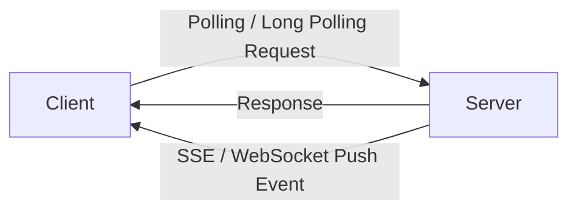
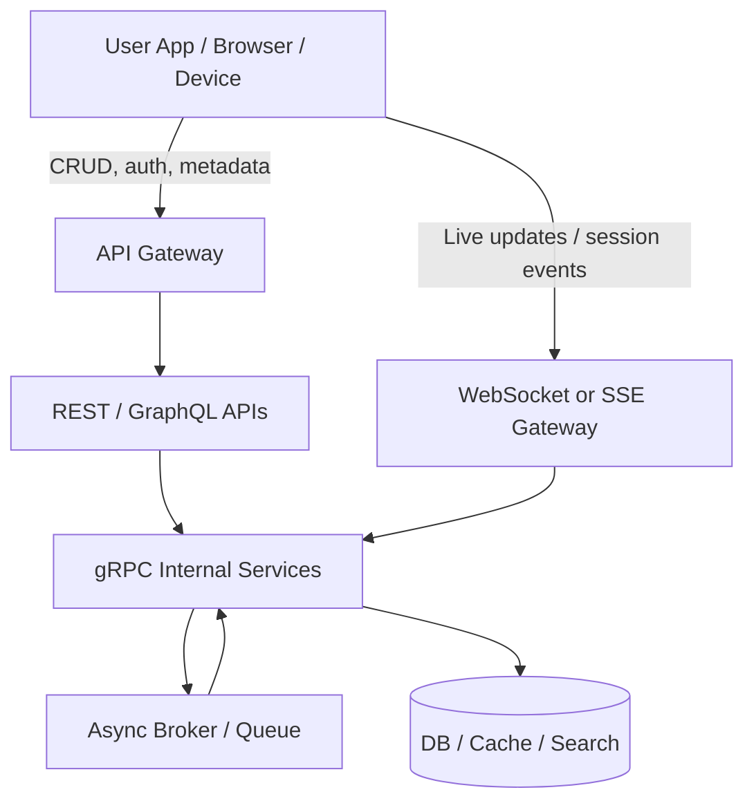
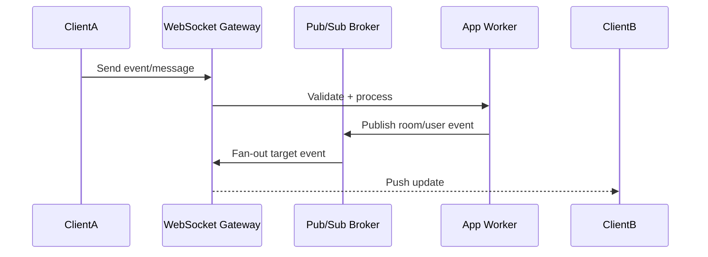

# Chapter 2 — Protocols, APIs & Real-Time Updates

> A practical chapter on **how systems communicate**, **how APIs are exposed**, and **how real-time updates actually work in production**.
>
> This is not just a glossary of protocols. The goal is to build the mental model to answer questions like:
> - Which protocol should I use here?
> - When is pull good enough and when do I need push?
> - Why do real systems combine multiple protocols instead of picking only one?
> - How do APIs differ when the workload is CRUD, streaming, low latency, or peer-to-peer?

---

## 1. Why this chapter matters

In system design, protocol selection is not a cosmetic decision. It directly affects:

- **latency**
- **throughput**
- **reliability**
- **infra cost**
- **developer experience**
- **mobile/network friendliness**
- **real-time user experience**

A strong engineer does not say, “Let’s use WebSocket because it is modern.”
They ask:

- Who initiates the communication?
- Is communication one-way or two-way?
- Do we need server push?
- Is ordering important?
- Can clients tolerate stale data?
- Do we need browser support?
- Does the system run over unreliable networks?
- Are clients mobile, IoT, desktop, or backend services?

That is the lens for the entire chapter.

---

## 2. Big picture: protocol families across the stack

A common mistake is to mix up protocols from different layers as if they compete directly. They usually do not.

For example:

- **IP** moves packets across networks.
- **TCP/UDP** define transport behavior.
- **TLS** adds encryption.
- **HTTP/gRPC/WebSocket** define application communication patterns.
- **WebRTC** is used for real-time peer/media communication.
- **OSPF/BGP** are routing protocols used by the network itself, not by your frontend app.

### Quick stack view

| Layer / Concern | Common protocols / standards | What they solve |
|---|---|---|
| Routing / Network control | OSPF, BGP, ICMP | How networks find paths and exchange reachability |
| Internet / Network | IP, ARP | Packet delivery and address resolution |
| Transport | TCP, UDP, QUIC | Reliability, ordering, flow control, latency trade-offs |
| Security | TLS | Encryption, integrity, identity |
| Naming / discovery | DNS | Resolving names like `amazon.com` to IPs |
| Application | HTTP, HTTPS, REST, GraphQL, gRPC, SSE, WebSocket, WebRTC | Business-level communication |

---

## 3. What is a protocol?

A **protocol** is a mutually agreed set of rules for communication.

It defines things like:

- message format
- connection establishment
- retries or acknowledgments
- ordering guarantees
- timeout behavior
- error semantics
- state transitions

Without protocols, two systems may be connected physically but still cannot communicate meaningfully.

### Mental model

A protocol is not “just data.”
It is the **contract for how data is exchanged safely and predictably**.

---

## 4. Important protocols you should actually care about

There are hundreds of protocols in networking, but in product/system design interviews and most backend systems, a smaller set matters repeatedly.

### Networking and control plane protocols

| Protocol | Where it matters | Why you should care |
|---|---|---|
| DNS | Name resolution | Every internet-facing system depends on it |
| IP | Packet routing | Base layer for communication |
| TCP | Reliable transport | Most APIs and service-to-service traffic depend on it |
| UDP | Low-latency transport | Useful for real-time media, gaming, telemetry, custom protocols |
| TLS | Secure communication | Mandatory for production-grade internet traffic |
| OSPF | Internal routing in networks | Good mental model for shortest-path routing |
| BGP | Routing between networks/ASes | Important in internet-scale networking discussions |

### Application protocols and patterns

| Protocol / style | Best suited for |
|---|---|
| HTTP/1.1 | General request-response APIs, simple web traffic |
| HTTP/2 | Multiplexed APIs, modern service communication, gRPC transport |
| HTTP/3 | Low-latency internet-facing traffic over QUIC |
| REST | Standard CRUD-style APIs and resource-oriented systems |
| GraphQL | Flexible client-driven querying |
| gRPC | Service-to-service RPC, strongly typed contracts, streaming |
| SSE | One-way server-to-client event streams |
| WebSocket | Long-lived bidirectional app communication |
| WebRTC | Browser/device real-time audio, video, and peer communication |

---

## 5. Transport matters first: TCP vs UDP vs QUIC

Before choosing an API style, understand the transport behavior underneath.

### TCP

TCP is used when you want:

- reliable delivery
- ordered delivery
- retransmissions
- flow control
- congestion control

It is great for:

- HTTP APIs
- gRPC over HTTP/2
- database connections
- most backend service calls

But reliability and ordering come with overhead.

### UDP

UDP is used when you prefer:

- lower overhead
- lower latency
- tolerance for some packet loss
- application-controlled recovery behavior

It is useful for:

- voice/video media
- gaming
- some telemetry systems
- custom high-performance protocols

UDP does **not** give you reliability or ordering by default.
If you need them, your application must add them.

### QUIC

QUIC is a transport protocol built on UDP, designed to provide features like:

- secure transport
- reduced connection setup latency
- multiplexed streams
- improved behavior under packet loss compared to TCP head-of-line blocking at the connection level

HTTP/3 runs on top of QUIC.

### Practical rule

- If correctness and simplicity matter more, start with **TCP-based protocols**.
- If ultra-low latency media or custom transport behavior matters, consider **UDP/QUIC-based systems**.

---

## 6. HTTP evolution: 1.1 vs 2 vs 3

### HTTP/1.1

Most familiar web protocol model:

- request-response
- text-based semantics
- one request/response per connection flow pattern historically, though keep-alive improved reuse
- simple and universally supported

Good for:

- standard REST APIs
- admin panels
- public APIs
- services where simplicity matters more than stream multiplexing

### HTTP/2

Key improvements:

- multiplexing multiple streams over one connection
- header compression
- better efficiency for many small requests
- foundation for gRPC in most deployments

Good for:

- mobile apps calling many APIs
- backend services making many concurrent requests
- streaming RPCs via gRPC

### HTTP/3

Built over QUIC. Useful where connection setup latency and lossy network performance matter, especially on modern internet/mobile paths.

### Quick comparison

| Feature | HTTP/1.1 | HTTP/2 | HTTP/3 |
|---|---|---|---|
| Transport | TCP | TCP | QUIC over UDP |
| Multiplexing | Limited / inefficient | Yes | Yes |
| Header compression | Basic | Better | Better |
| Best for | Simplicity | Modern APIs and gRPC | Modern internet-facing low-latency traffic |

---

## 7. What is an API, really?

An **API** is the contract through which one software component exposes capabilities to another.

That capability can be:

- fetch user profile
- create order
- update device state
- stream model output
- push notifications
- upload media
- subscribe to events

### API is not equal to HTTP only

APIs can be exposed through:

- REST over HTTP
- GraphQL over HTTP
- gRPC over HTTP/2
- WebSocket message contracts
- SSE event streams
- internal message brokers and async event contracts

So when people say “design the API,” they should also be thinking about:

- sync vs async
- pull vs push
- request-response vs stream
- typed contract vs flexible payload
- connection lifetime
- versioning
- idempotency
- authentication and authorization

---

## 8. REST vs GraphQL vs gRPC

These do not solve exactly the same problem. They overlap, but each shines in different situations.

### REST

REST is resource-oriented.

Typical examples:

- `GET /users/123`
- `POST /orders`
- `PUT /devices/abc/state`

Good when:

- you want simple, debuggable APIs
- caching is important
- resource modeling is natural
- broad tooling and interoperability matter

Trade-offs:

- can over-fetch or under-fetch
- multiple round trips may be needed for complex UIs
- contract may feel coarse for highly interactive clients

### GraphQL

GraphQL lets the client ask for exactly the fields it needs.

Good when:

- UI screens need flexible data composition
- frontend teams want fewer round trips
- many clients need different shapes of the same entity graph

Trade-offs:

- caching is harder than simple REST semantics
- backend complexity often increases
- query cost control becomes important
- careless schemas can create expensive nested fetches

### gRPC

gRPC is strongly typed RPC, typically over HTTP/2, using Protocol Buffers.

Good when:

- service-to-service communication dominates
- performance matters
- strong contracts and code generation help
- streaming is useful

Trade-offs:

- less browser-native than REST
- debugging is less human-readable than JSON APIs
- public API consumers often prefer REST/HTTP

### Comparison table

| Dimension | REST | GraphQL | gRPC |
|---|---|---|---|
| Best fit | Public APIs, CRUD, simple services | UI-driven data fetching | Internal services, high-performance RPC |
| Payloads | Usually JSON | JSON-like query/response | Protobuf |
| Typing | Moderate | Schema-based | Strongly typed |
| Streaming | Not natural by default | Possible, but not primary strength | Strong support |
| Caching | Strong with HTTP semantics | Harder | Usually handled differently |
| Browser friendliness | Excellent | Excellent | Limited without extra layers |

---

## 9. Real-time updates: the actual question is pull vs push

Most “real-time updates” discussions are really about this:

> **Who initiates data movement, and how quickly must updates arrive?**

### Pull model

The client asks repeatedly:

- “Any new messages?”
- “Any status change?”
- “Any new events?”

Examples:

- polling
- long polling
- periodic refresh

### Push model

The server pushes when data changes.

Examples:

- SSE
- WebSocket
- WebRTC data/media channels
- push notifications in broader system architectures

### Mental model

- **Pull** is simpler and safer for many systems.
- **Push** is more responsive, but operationally more complex.

---

## 10. Polling, Long Polling, SSE, WebSocket, WebRTC

This is the core real-time toolkit most engineers should know.

### 10.1 Polling

Client sends requests at fixed intervals.

Example:

- mobile app checks order status every 5 seconds

Good for:

- low-frequency updates
- simple dashboards
- systems where slight staleness is acceptable

Problems:

- wasted requests when nothing changes
- latency tied to polling interval
- costly at scale if millions of clients poll frequently

### 10.2 Long Polling

Client makes a request; server holds it open until an event arrives or timeout happens. Then client reconnects.

Good for:

- near-real-time without full WebSocket complexity
- systems where updates are sporadic

Problems:

- repeated connection churn
- harder scaling under many clients
- still less elegant than a persistent bidirectional channel

### 10.3 Server-Sent Events (SSE)

A long-lived HTTP connection where the **server streams events to the client**.

Good for:

- server-to-client one-way streaming
- notifications
- progress updates
- AI token streams to a browser
- dashboards where client rarely needs to talk back over the same channel

Strengths:

- simpler than WebSocket
- works well with HTTP semantics
- natural fit for one-way event streams

Limitations:

- unidirectional
- not ideal for arbitrary bidirectional interactions
- browser/client/network support patterns should still be validated for your stack

### 10.4 WebSocket

A persistent full-duplex connection between client and server.

Good for:

- chat
- collaborative editing
- multiplayer signaling
- trading screens
- device control channels
- agentic/interactive UIs with continuous back-and-forth events

Strengths:

- low-latency bidirectional updates
- avoids repeated polling
- suitable for interactive sessions

Challenges:

- sticky sessions or shared connection-state management
- heartbeats and connection liveness
- reconnect storms after failures
- fan-out across multiple nodes
- backpressure and per-connection memory usage

### 10.5 WebRTC

WebRTC is for real-time peer communication, especially audio/video/data.

Good for:

- video calls
- voice calls
- peer media streaming
- browser-based low-latency media systems

Important note:

WebRTC is not “just a faster WebSocket.”
It solves a different class of problem.

It typically relies on pieces like:

- signaling channel
- ICE
- STUN
- TURN
- secure media/data transport

Trade-offs:

- operationally more complex
- NAT traversal is non-trivial
- excellent for peer/media scenarios, overkill for normal CRUD apps

---

## 11. Quick comparison: which real-time option when?

| Option | Direction | Good for | Why not always use it? |
|---|---|---|---|
| Polling | Client → Server repeated requests | Simple status checks, low update frequency | Wasteful and not truly real-time |
| Long Polling | Mostly server update via held request | Sporadic near-real-time events | Connection churn and scaling overhead |
| SSE | Server → Client | Notifications, progress, token streaming | One-way only |
| WebSocket | Bidirectional | Chat, live collaboration, control channels | Stateful scaling complexity |
| WebRTC | Peer-to-peer / media / data | Calls, real-time audio/video, browser peer communication | Complex setup and infra support |

---

## 12. Server-driven vs client-driven updates

Another helpful mental model:

### Client-driven model

The client asks:

- polling
- manual refresh
- query on demand
- GraphQL queries triggered by UI actions

### Server-driven model

The server pushes when data changes:

- SSE
- WebSocket
- streaming gRPC
- pub-sub feeding gateway push channels

### When client-driven is enough

Use it when:

- staleness of a few seconds is okay
- update frequency is low
- infra simplicity matters more than immediacy
- clients are not constantly connected

### When server-driven is better

Use it when:

- updates must be visible immediately
- user experience depends on low latency
- the client must react to external events without asking repeatedly
- collaboration or session continuity matters

---

## 13. Real-world mapping: where each protocol style shines

### E-commerce

A single product/application may use multiple protocols together:

- **REST/HTTP** for browsing products, checkout, address updates
- **GraphQL** for complex frontend aggregation on product detail pages
- **SSE or WebSocket** for order status live updates or flash sale counters
- **gRPC** for service-to-service internal communication
- **Kafka / async events** behind the scenes for order processing and analytics

### Voice assistant / Alexa-like ecosystem

A real product rarely uses only one communication mode:

- **HTTPS/REST** for configuration, account linking, metadata, device management
- **gRPC or internal RPC** between backend services where strict contracts matter
- **WebSocket-like persistent control channels** for low-latency session signaling or device state exchange in some architectures
- **UDP / media-specific transport / WebRTC-like stack** where actual real-time media is involved, depending on product architecture
- **async pub-sub** for device state propagation, telemetry, and event routing

### LLM / AI product

Common pattern:

- **REST** for standard request submission, metadata, chat history fetch
- **SSE** for token streaming to browser UIs
- **WebSocket** when the session is truly interactive and bidirectional, e.g. tool progress, interrupts, collaborative AI sessions
- **gRPC** for model gateway to internal service communication
- **message queues** for async tasks like embeddings, indexing, evaluation, or delayed tool execution

### Live collaboration app

- **REST** for document metadata and persistence
- **WebSocket** for cursor movement, edits, and presence
- **pub-sub / broker** for fan-out across many collaboration servers
- **periodic persistence API** to checkpoint current state

---

## 14. Why real systems use multiple protocols together

This is one of the most important design lessons.

A serious production system almost never says:

> “We use WebSocket everywhere.”

Instead it says:

- Use **REST** where request-response is enough.
- Use **GraphQL** where client flexibility matters.
- Use **gRPC** between internal services for speed and contracts.
- Use **SSE** for one-way streams.
- Use **WebSocket** only where true bidirectional low-latency sessions are needed.
- Use **WebRTC** only when real-time peer/media communication is the actual product need.

### Rule of thumb

Choose the **simplest protocol that satisfies the workload**.
Do not pay stateful real-time complexity for a problem that only needs periodic fetches.

---

## 15. Mermaid diagrams

### 15.1 Pull vs Push model



### 15.2 How protocols combine in one application



### 15.3 WebSocket with broker-backed fan-out



---

## 16. Mini code snippets

These are not production-ready; they are just mental anchors.

### 16.1 Simple REST API in Python (FastAPI style)

```python
from fastapi import FastAPI

app = FastAPI()

@app.get("/users/{user_id}")
def get_user(user_id: int):
    return {"user_id": user_id, "name": "Crosmas"}
```

### 16.2 SSE endpoint in Python

```python
from fastapi import FastAPI
from fastapi.responses import StreamingResponse
import time

app = FastAPI()

def event_stream():
    for i in range(5):
        yield f"data: token-{i}\n\n"
        time.sleep(1)

@app.get("/stream")
def stream():
    return StreamingResponse(event_stream(), media_type="text/event-stream")
```

### 16.3 WebSocket example in Python

```python
from fastapi import FastAPI, WebSocket

app = FastAPI()

@app.websocket("/ws")
async def websocket_endpoint(ws: WebSocket):
    await ws.accept()
    while True:
        message = await ws.receive_text()
        await ws.send_text(f"echo: {message}")
```

### 16.4 gRPC contract example

```proto
syntax = "proto3";

service ChatService {
  rpc SendMessage (SendMessageRequest) returns (SendMessageResponse);
  rpc StreamMessages (StreamMessagesRequest) returns (stream ChatEvent);
}

message SendMessageRequest {
  string room_id = 1;
  string user_id = 2;
  string text = 3;
}

message SendMessageResponse {
  string message_id = 1;
}

message StreamMessagesRequest {
  string room_id = 1;
}

message ChatEvent {
  string user_id = 1;
  string text = 2;
  int64 ts_ms = 3;
}
```

---

## 17. API design considerations that matter in production

Protocol choice is only part of the story. The API contract itself matters just as much.

### 17.1 Versioning

You need a strategy for API evolution:

- URL versioning like `/v1/orders`
- schema evolution in GraphQL
- protobuf backward compatibility in gRPC
- message version fields for async streams

### 17.2 Idempotency

Critical for:

- payment APIs
- retries after timeouts
- order creation
- webhook reprocessing

Example:

If `POST /payments` times out, the client may retry. Without idempotency keys, you may charge twice.

### 17.3 Authentication and authorization

Common choices:

- OAuth2 / OIDC for user-facing APIs
- JWT/session tokens
- mTLS or service identity for internal RPC
- signed requests in some high-trust internal systems

### 17.4 Caching

REST often works very well with HTTP caching semantics.
GraphQL and WebSocket flows usually need different caching strategies.

### 17.5 Backpressure

Very important in streaming and real-time systems.

If the producer is faster than the consumer:

- queues grow
- memory grows
- latency explodes
- connections may collapse

This is why protocol choice must be discussed with throughput behavior, not only API beauty.

---

## 18. Trade-offs that good engineers mention explicitly

### WebSocket is not always better than SSE

Use SSE when:

- you only need server-to-client streaming
- browser clients are primary
- implementation simplicity matters
- you want HTTP-friendly semantics

Use WebSocket when:

- client and server both need to speak frequently
- session state is interactive
- low-latency bidirectional messaging matters

### GraphQL is not always better than REST

Use GraphQL when:

- clients need flexible field selection
- frontend composition is complex

Use REST when:

- resource modeling is clear
- HTTP caching and simplicity matter
- public integrations need stability and ease of adoption

### gRPC is not always better than REST

Use gRPC when:

- internal service-to-service performance matters
- typed contracts and generated clients help
- streaming is valuable

Use REST when:

- the client is external or browser-heavy
- debugging and operability simplicity matter

### Polling is not always bad

Polling is perfectly reasonable when:

- freshness needs are modest
- update frequency is low
- clients are intermittent
- infra simplicity wins

---

## 19. Failure modes and production pain points

### Polling

- request amplification at scale
- stale UX between polling intervals
- load spikes if everyone polls on the same cadence

### Long Polling

- lots of hanging requests
- timeout tuning complexity
- reconnect churn under scale

### SSE

- reconnection behavior must be handled well
- one-way only
- event ordering and replay need thought if correctness matters

### WebSocket

- broken but half-open connections
- heartbeat tuning
- reconnect storms after node or LB failures
- session affinity and distributed fan-out complexity
- message duplication after reconnect/retry

### WebRTC

- NAT traversal complexity
- TURN relay costs
- signaling complexity
- browser/device interoperability issues

### API layer in general

- schema drift
- backward compatibility issues
- poor timeout/retry design
- missing idempotency
- auth mistakes
- no rate limiting

---

## 20. Interview / problem-solving mapping

This is where protocol knowledge often connects to coding or systems interviews.

### OSPF → shortest path / Dijkstra mental model

OSPF is a routing protocol used inside autonomous systems to compute shortest paths based on link costs.

Interview mapping:

- Dijkstra’s algorithm
- shortest path in weighted graphs
- network delay style questions

### API rate limiting → sliding window / token bucket

Interview mapping:

- design a rate limiter
- token bucket
- leaky bucket
- fixed/sliding window counters

### Reliable messaging → deduplication + ordering

Interview mapping:

- sequence IDs
- idempotency keys
- exactly-once vs at-least-once trade-offs

### Real-time fan-out → pub-sub + queues

Interview mapping:

- design chat system
- notification system
- live comments / collaboration platform

### Sticky sessions vs distributed state

Interview mapping:

- consistent hashing
- shared Redis session store
- stateless gateway vs stateful connection manager

---

## 21. Practical selection guide

If you are unsure, use this guide.

### You need simple CRUD APIs

Choose:

- REST over HTTP

### You need client-specific flexible data fetch

Choose:

- GraphQL

### You need high-performance service-to-service calls

Choose:

- gRPC

### You need one-way live progress or event stream to browser

Choose:

- SSE

### You need bidirectional low-latency interactive session

Choose:

- WebSocket

### You need browser/device real-time audio/video or peer communication

Choose:

- WebRTC

### You need low-frequency updates only

Choose:

- polling first, then upgrade only if needed

---

## 22. One realistic multi-protocol example

### AI voice assistant + app ecosystem

A single product can legitimately use all of the following:

- **REST** for login, settings, device metadata, chat history
- **GraphQL** for app screen aggregation if frontend composition is complex
- **gRPC** between orchestration, profile, recommendation, and ranking services
- **SSE** for browser token streaming in web chat UI
- **WebSocket** for live assistant session events, interrupts, partial state updates, tool progress, or command/control channels
- **WebRTC or media-specific real-time transport** for live voice/video interaction where needed
- **async events** for telemetry, analytics, retries, indexing, and downstream workflows

This is the right mental model:

> **A product uses a protocol portfolio, not a protocol religion.**

---

## 23. Key takeaways

- Protocol choice is really workload choice.
- Start by asking whether the problem is request-response, stream, bidirectional session, or peer media.
- TCP-based APIs are the default for correctness and simplicity.
- REST, GraphQL, and gRPC each fit different product and team constraints.
- Real-time does not automatically mean WebSocket.
- SSE is excellent for one-way server streaming.
- WebSocket is powerful but operationally more complex.
- WebRTC is for peer/media scenarios, not general CRUD APIs.
- Pull models are often underrated because they are easier to operate.
- Good systems often combine multiple protocols at different layers.
- In interviews, the best answer is usually the simplest design that satisfies latency and product constraints.

---

## 24. Suggested repo cross-links

Good follow-up chapters after this one:

- load balancing
- caching
- idempotency
- retries, backoff, and jitter
- pub-sub
- message queues
- rate limiting
- service discovery
- backpressure
- chat system design
- notification system design
- voice session architecture

---

## 25. Study resources

### Official / foundational

- RFC 9110 / HTTP Semantics
- RFC 6455 / WebSocket
- Protocol Buffers + gRPC official docs
- MDN docs for SSE, WebSocket, WebRTC
- QUIC / HTTP/3 overview docs

### Good topics to deepen next

- head-of-line blocking
- congestion control
- flow control vs backpressure
- idempotency in distributed systems
- API gateway patterns
- pub-sub fan-out for WebSocket systems
- STUN / TURN / ICE in WebRTC

---

## 26. Final engineering summary

When choosing communication patterns in a real system:

1. Start from the **user experience requirement**.
2. Translate that into **latency + freshness + directionality**.
3. Pick the **simplest protocol** that satisfies those needs.
4. Think immediately about **scaling, retries, state, and failure modes**.
5. Accept that real systems usually combine **REST + streaming + async events + internal RPC**, not just one protocol everywhere.

That is the difference between knowing protocol names and actually designing systems well.
