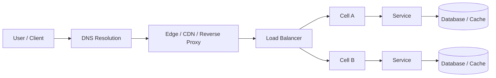
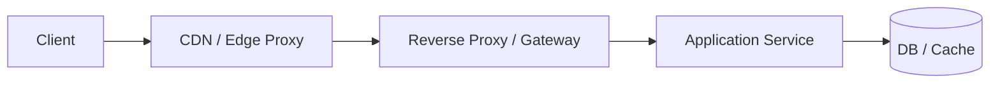
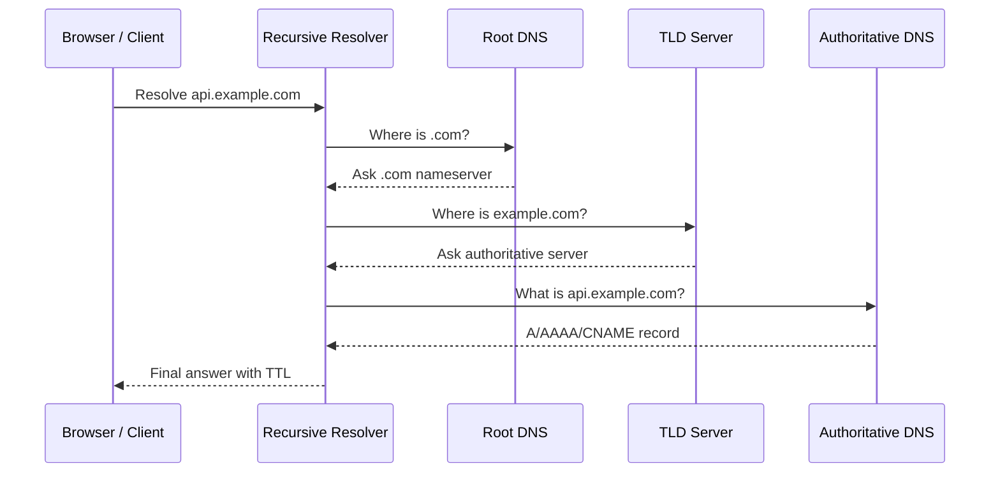
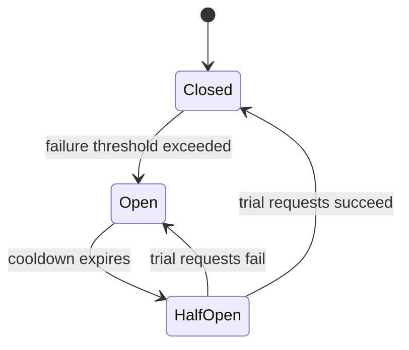
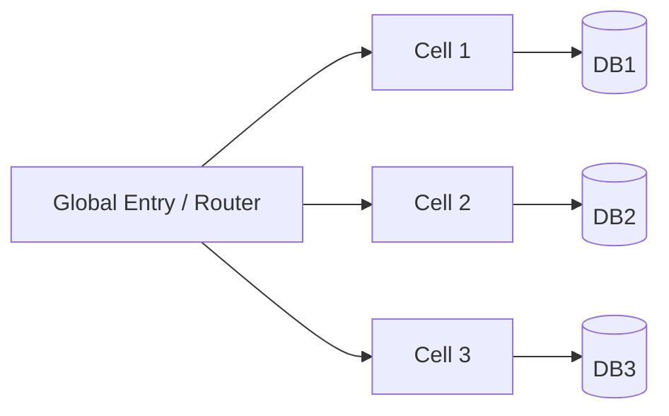
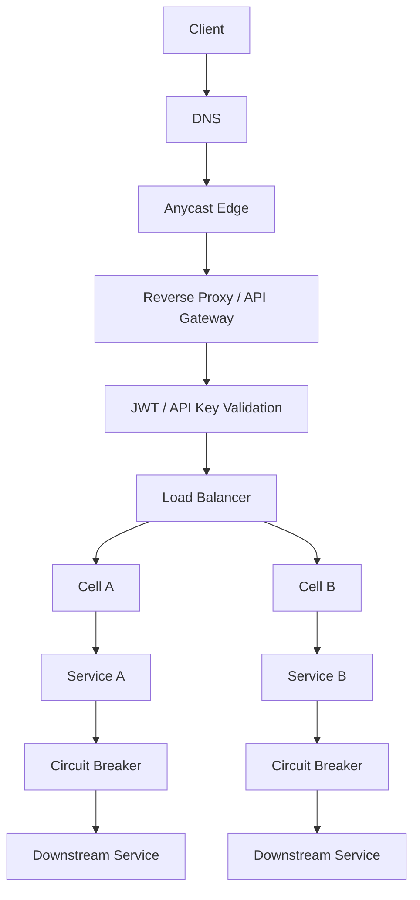

# Chapter 3 — Traffic, Resilience, Routing & Trust Primitives

> This chapter covers the system-design building blocks that quietly decide whether a system is **fast**, **stable**, **globally reachable**, and **secure**.
>
> These topics often appear as side concepts in interviews or production discussions: proxy, reverse proxy, DNS, circuit breaker, cells, anycast, sticky sessions, jitter, JWT, API keys. But in real systems, these are not side topics. They are the difference between a system that merely works and a system that keeps working under scale, failures, and global traffic.

---

## Why this chapter matters

A surprising number of outages, latency regressions, and scaling problems come from weak understanding of traffic flow and fault isolation.

Examples:

- A service scales horizontally, but still fails because all sessions are tied to one node.
- Retries are added to improve resilience, but synchronized retries make the outage worse.
- A global product goes multi-region, but traffic still takes slow paths because routing strategy is naive.
- Authentication works in dev, but production security weakens because long-lived JWTs cannot be revoked easily.
- A backend is healthy, but users still see failures because DNS, edge routing, or proxy behavior is wrong.

This chapter builds the mental model behind those production realities.

---

## What this chapter covers

- Forward proxy vs reverse proxy
- Where VPN fits into the network path
- DNS as the first control plane of internet traffic
- Resilience patterns: circuit breaker, timeout, retry, half-open, jitter
- Data locality and cell-based architecture
- Anycast routing and why global systems use it
- Sticky sessions and session affinity trade-offs
- Authorization basics: JWT vs API keys
- Practical production patterns and interview framing

---

# 1. Big picture mental model

When a user request enters a modern system, a lot more happens than “client calls server.”

A realistic path may look like this:



At each stage, a different primitive may matter:

- **DNS** decides where traffic starts going.
- **Anycast** decides which edge or POP traffic reaches.
- **Reverse proxy** terminates TLS, applies routing rules, and protects origins.
- **Sticky sessions** influence whether a user keeps hitting the same server.
- **Circuit breaker** determines whether a failing downstream keeps receiving traffic.
- **Jitter** determines whether retries create recovery or stampede.
- **Cell architecture** determines whether a failure stays local or becomes regional.
- **JWT / API keys** determine whether requests are trusted.

That is the chapter lens.

---

# 2. Proxy and reverse proxy

## 2.1 What is a proxy?

A **proxy** is an intermediary that sits between two parties in a network path and forwards traffic on behalf of one side.

But there are two very different meanings in practice:

- **Forward proxy**: acts on behalf of the client
- **Reverse proxy**: acts on behalf of the server

This distinction is extremely important.

---

## 2.2 Forward proxy

A **forward proxy** sits closer to the client and makes requests on the client’s behalf.

### Common uses

- enterprise internet access control
- privacy masking of client identity
- outbound filtering
- caching of frequently requested external content
- geolocation / egress control

### Mental model

The client says:
> “I do not want to connect to the internet directly. Please fetch the data for me.”

### Example

Inside a corporate office network:

- employees cannot directly access all external sites
- all internet access goes through a corporate proxy
- the proxy logs, filters, and audits outbound traffic

---

## 2.3 Reverse proxy

A **reverse proxy** sits closer to the server side and receives requests from clients before forwarding them to origin servers.

### Common uses

- TLS termination
- request routing
- load balancing
- caching
- WAF / security filtering
- compression
- rate limiting
- hiding internal server topology

### Mental model

The client thinks it is talking to the server, but actually it is talking to a front door that represents the server fleet.

### Real-world examples

- NGINX in front of app servers
- Envoy sidecars / gateways
- cloud load balancers
- CDN edges acting as reverse proxies

---

## 2.4 Forward proxy vs reverse proxy

| Dimension | Forward Proxy | Reverse Proxy |
|---|---|---|
| Represents | Client | Server |
| Sits near | Client side | Server side |
| Main purpose | Client control / privacy / egress | Traffic management / protection / scaling |
| Typical users | Enterprises, corporate networks, privacy tools | Web apps, APIs, CDNs, load balancers |
| Client aware? | Usually yes | Often no; client thinks it is origin |

---

## 2.5 Why reverse proxies are everywhere in system design

Reverse proxies appear almost everywhere because they solve many cross-cutting concerns in one place:

- one place to terminate TLS
- one place to do routing
- one place to enforce request size limits
- one place to add headers like `X-Forwarded-For`
- one place to protect fragile origins from direct exposure

### In large companies

A typical request path is often:



### In Alexa / voice / device systems

Even if the media plane uses different protocols, the **control plane** often still relies on reverse proxies or API gateways for:

- session setup
- auth enforcement
- traffic shaping
- feature flags
- safe origin exposure

---

## 2.6 Common pitfalls with proxies

- trusting `X-Forwarded-For` blindly
- forgetting the real client IP is hidden behind proxy layers
- not accounting for header/body size limits
- double compression or double TLS misunderstandings
- sticky sessions introduced unintentionally at the proxy layer
- health checks saying “up” while real dependency path is degraded

---

# 3. VPN basics

## 3.1 What is a VPN?

A **VPN** creates a secure logical tunnel over an otherwise untrusted network.

In simple terms:

> It lets traffic travel through the public internet as if it were part of a trusted private network.

### Why teams use VPNs

- secure access to internal services
- remote employee access
- site-to-site connectivity between offices / VPCs / datacenters
- traffic isolation from public networks

### Mental model

A VPN does not magically make the internet private.
It creates an **encrypted overlay path** on top of the internet.

---

## 3.2 VPN in system design context

For system design, VPN matters less as a feature and more as an infrastructure enabler.

Examples:

- engineers accessing internal dashboards
- private database access from office or bastion networks
- branch office to cloud networking
- hybrid cloud communication

### Important distinction

VPN is not a replacement for app-layer auth.
Even inside a VPN, services still need:

- authentication
- authorization
- auditing
- service identity

Never assume:
> “It is on the VPN, so it is safe enough.”

---

# 4. DNS — the first traffic control point

## 4.1 What is DNS?

**DNS (Domain Name System)** maps human-readable names like `api.example.com` to machine-usable records such as IP addresses. In practice, DNS is hierarchical and decentralized, and it is one of the first systems every internet request touches. 

### Why DNS matters so much

DNS is not just naming. It is also used for:

- service indirection
- failover
- region steering
- CDN onboarding
- mail routing
- canary migration
- blue/green cutovers

In many systems, **DNS is the first control plane for traffic distribution**. citeturn1search1turn1search8

---

## 4.2 Common DNS record types worth knowing

| Record | Purpose | Example use |
|---|---|---|
| A | hostname to IPv4 | `api.example.com -> 203.0.113.10` |
| AAAA | hostname to IPv6 | IPv6 deployment |
| CNAME | alias to another hostname | `www -> app-edge.example.net` |
| NS | authoritative nameserver | domain delegation |
| MX | mail routing | email delivery |
| TXT | metadata / verification | SPF, DKIM, domain verification |

---

## 4.3 DNS flow at high level



---

## 4.4 DNS in real production systems

### Use cases

- send users to nearest region
- point traffic to CDN edge
- shift traffic during failover
- isolate tenants using subdomains
- move traffic from old infrastructure to new infrastructure gradually

### DNS trade-off

DNS is powerful, but **not instant control**.
TTL, caching, and resolver behavior mean changes may not propagate immediately.

So DNS is great for:

- coarse routing
- failover
- indirection

But not always sufficient for:

- sub-second traffic steering
- per-request dynamic policy

That is where edge proxies and load balancers take over.

---

# 5. Anycast routing

## 5.1 What is anycast?

**Anycast** is a routing approach where multiple machines or sites advertise the same IP address, and the network routes the client to one of the nearest or best reachable locations. In CDN and DNS systems, this is commonly used to reduce latency, improve resilience, and absorb DDoS volume across many locations. citeturn1search0turn1search4

### Mental model

- **Unicast**: one IP points to one destination
- **Anycast**: one IP can be served by many destinations

The internet routing system decides which instance you reach.

---

## 5.2 Why anycast is useful

- lower latency to nearest edge
- better resilience if one site fails
- traffic spread across POPs
- useful for global DNS and CDN entry points
- helpful in DDoS absorption because load is distributed geographically

### Typical systems using anycast

- global DNS resolvers
- CDN front doors
- edge security networks
- TURN / media edge services in some real-time systems

---

## 5.3 Anycast vs DNS-based geo routing

| Dimension | Anycast | DNS-based geo routing |
|---|---|---|
| Decision point | Network routing | DNS resolution |
| Granularity | Packet / path level | Resolution-time steering |
| Best for | Edge entry points, DNS, CDN, global POPs | Region selection, failover, origin steering |
| Operational feel | Network-driven | Control-plane driven |

### Practical rule

Use DNS to decide **which system family / region / service namespace** a client should use.
Use anycast to get the client efficiently to the **nearest serving edge**.

---

# 6. Sticky sessions

## 6.1 What are sticky sessions?

**Sticky sessions** (session affinity) mean routing a user’s repeated requests to the same backend instance instead of distributing each request independently. Load balancers often implement this using cookies or client-IP based affinity. citeturn1search2turn1search6

### Why sticky sessions exist

Because some applications keep important session state in process memory:

- shopping cart
- login session context
- WebSocket connection ownership
- server-local caches
- game room state

If the next request goes to a different instance and the state is not shared, the request may fail or behave inconsistently.

---

## 6.2 When sticky sessions help

- legacy monoliths with in-memory sessions
- WebSocket connection ownership
- transitional architectures before shared session storage is introduced
- stateful real-time workloads where session handoff is expensive

---

## 6.3 Why sticky sessions are dangerous long-term

Sticky sessions often solve a local problem while creating a scaling problem.

### Trade-offs

- uneven load distribution
- hot users can hot-spot a single node
- failover becomes painful if the sticky node dies
- autoscaling becomes less efficient
- hard to rebalance existing live sessions

### Better long-term approaches

- move session state to shared store like Redis / DB
- make services stateless where possible
- partition by stable keys intentionally, not accidentally
- use sticky sessions only where session ownership truly matters

---

## 6.4 Sticky sessions in real-time systems

For HTTP APIs, stateless is usually better.
For **WebSocket**, **streaming**, or **session-oriented control planes**, some form of affinity is often unavoidable.

Example:

- the client opens a WebSocket to node A
- that node owns connection buffers, heartbeats, and subscription state
- later HTTP requests related to that session may need awareness of node A

This is why real-time systems often combine:

- sticky routing for live connections
- shared pub/sub for fan-out
- distributed metadata for session lookup

---

# 7. Resilience: timeouts, retries, backoff, jitter, and circuit breakers

## 7.1 Why resilience primitives matter

In distributed systems, failures are normal:

- packet loss
- transient network partition
- overloaded downstream
- cold restarts
- partial regional impairment
- queue saturation
- dependency latency spikes

The worst mistake is to treat every failure the same way.

A good system distinguishes:

- transient failure
- persistent dependency failure
- client error
- overload
- timeout vs refusal

Then it applies the right control mechanism.

---

## 7.2 Timeout

A **timeout** prevents waiting forever.

If a downstream service does not respond within a defined time budget, the call fails fast.

### Why it matters

Without timeouts:

- threads block too long
- connection pools get exhausted
- upstream latency explodes
- failure cascades spread

Timeouts are the first line of defense.

---

## 7.3 Retry

A **retry** is useful when failures are transient.

Examples:

- temporary network hiccup
- short-lived throttling
- node restart

But retries are dangerous when:

- the error is permanent
- the downstream is already overloaded
- every client retries at the same time

Retries should not be unconditional.

---

## 7.4 Backoff and jitter

**Backoff** means waiting longer between retry attempts instead of retrying immediately.
**Jitter** means randomizing that wait a bit so many clients do not retry in lockstep.

Why jitter matters: if thousands of clients all retry after exactly 200 ms, 400 ms, 800 ms, they create synchronized bursts that can prolong or worsen an outage. AWS explicitly recommends combining retries with exponential backoff and jitter for this reason. citeturn1search3turn1search7turn1search15

### Mental model

Without jitter:
- all clients sleep the same time
- all wake together
- all hit the downstream together

With jitter:
- retry traffic spreads out
- recovery becomes smoother
- probability of another synchronized overload reduces

### Tiny Python example

```python
import random
import time


def call_with_backoff(fn, max_retries=5, base_delay=0.1, cap=2.0):
    for attempt in range(max_retries):
        try:
            return fn()
        except Exception:
            # exponential backoff with full jitter
            max_sleep = min(cap, base_delay * (2 ** attempt))
            time.sleep(random.uniform(0, max_sleep))
    raise RuntimeError("operation failed after retries")
```

---

## 7.5 Circuit breaker

A **circuit breaker** protects a system from repeatedly calling a dependency that is likely failing.

The core idea: once failures cross a threshold, stop sending normal traffic for a while and fail fast instead. This is the classic circuit breaker pattern described by Martin Fowler. citeturn0search1turn0search9

### Why it exists

Without a circuit breaker:

- every request keeps hammering a broken dependency
- latency balloons due to repeated timeouts
- thread pools / connection pools get exhausted
- the original failure spreads upward

### States

- **Closed**: normal operation, requests flow
- **Open**: dependency considered unhealthy, fail fast
- **Half-open**: allow limited trial traffic to check if recovery happened



---

## 7.6 Half-open state — why it is so important

The **half-open** state is the recovery probe state.

If a breaker moved directly from open to closed, it could flood a dependency that has only partially recovered.

Instead, half-open says:

> “Let only a small amount of traffic through. If it succeeds, recover. If not, open again.”

### Practical analogy

Closed = highway open
Open = road blocked
Half-open = let a few vehicles test if the bridge is safe again

---

## 7.7 Minimal Python circuit breaker example

```python
import time


class CircuitBreaker:
    def __init__(self, failure_threshold=5, reset_timeout=10):
        self.failure_threshold = failure_threshold
        self.reset_timeout = reset_timeout
        self.failures = 0
        self.state = "CLOSED"
        self.opened_at = None

    def allow_request(self):
        if self.state == "OPEN":
            if time.time() - self.opened_at >= self.reset_timeout:
                self.state = "HALF_OPEN"
                return True
            return False
        return True

    def record_success(self):
        self.failures = 0
        self.state = "CLOSED"
        self.opened_at = None

    def record_failure(self):
        self.failures += 1
        if self.failures >= self.failure_threshold:
            self.state = "OPEN"
            self.opened_at = time.time()

    def call(self, fn, *args, **kwargs):
        if not self.allow_request():
            raise RuntimeError("circuit open; failing fast")
        try:
            result = fn(*args, **kwargs)
            self.record_success()
            return result
        except Exception:
            self.record_failure()
            raise
```

### Real production note

Real implementations also track:

- rolling windows
- different failure classes
- success thresholds for half-open recovery
- concurrency caps for half-open probes
- metrics and alerts

---

## 7.8 Related resilience patterns

Circuit breaker is powerful, but it is not alone.

| Pattern | What it solves |
|---|---|
| Timeout | Prevent infinite waits |
| Retry | Recover transient failures |
| Backoff | Avoid instant retry storms |
| Jitter | Avoid synchronized retry waves |
| Circuit Breaker | Prevent hammering unhealthy dependencies |
| Bulkhead | Isolate resource pools so one failure does not consume all capacity |
| Load shedding | Reject excess work intentionally |
| DLQ | Isolate repeatedly failed async work |

### Important design note

These patterns are strongest when composed together.

Example:

- short timeout
- limited retries
- exponential backoff + jitter
- circuit breaker after repeated failure
- fallback if possible

---

# 8. Data locality and cell-based architecture

## 8.1 What is data locality?

**Data locality** means keeping computation close to the data or keeping users close to the data they need.

Why it matters:

- lower latency
- lower network cost
- lower blast radius
- better cache efficiency
- simpler compliance / residency boundaries in some systems

Examples:

- user served from nearest region
- analytics worker scheduled near data shard
- per-tenant data pinned to one region / cell

---

## 8.2 What is cell-based architecture?

A **cell-based architecture** divides a system into relatively self-contained units called cells. Each cell handles a slice of traffic or tenants, with the goal that failures remain isolated instead of becoming system-wide. AWS guidance explicitly describes cells as self-contained and not sharing state across cells by definition. citeturn0search4turn0search16

### Why cells are used

- fault isolation
- smaller blast radius
- safer deployments
- predictable scaling
- easier regional or tenant segmentation

### Mental model

Instead of one giant service fleet:

- Cell A serves some users / tenants
- Cell B serves another slice
- Cell C serves another slice

A failure in Cell A should not automatically take down B and C.



---

## 8.3 Cell architecture vs sharding

They are related, but not identical.

| Concept | Main purpose |
|---|---|
| Sharding | Partition data or traffic for scale |
| Cell architecture | Partition systems for fault isolation and operational containment |

A cell may contain its own shards.
But the goal of a cell is usually bigger than just scale; it is also **blast-radius control**.

---

## 8.4 Where cell-based design shows up

- multi-tenant SaaS
- regionally distributed systems
- large control planes
- systems where deployments must be isolated gradually
- high-availability architectures where black-swan containment matters

### In voice / smart-device ecosystems

Cell-like thinking is useful when:

- device fleets are very large
- partner/device classes behave differently
- a bad rollout should impact only a subset
- one overloaded domain should not poison all others

---

# 9. Jitter, load waves, and retry storms

Jitter deserves its own section because people often understand retries but underestimate synchronization effects.

## 9.1 The problem

Suppose 50,000 clients call a dependency.
The dependency slows down.
All clients retry after the same timeout.

Now you have:

- original traffic
- retry traffic
- retries synchronized in waves

This creates self-inflicted DDoS behavior.

## 9.2 Why jitter fixes it

Jitter intentionally randomizes retry timing, which spreads the recovery load over time rather than concentrating it into bursts. AWS notes this as a preferred practice in client libraries and resilient system design. citeturn1search3turn1search7

### Interview phrasing

If the interviewer asks:
> “Why not just use exponential backoff?”

A strong answer is:
> “Because exponential backoff without jitter can still cause synchronized retry waves. Jitter de-correlates clients and reduces thundering herd effects.”

---

# 10. Authorization: JWT vs API Keys

## 10.1 Why this matters

Many systems design discussions mention “auth” casually, but in practice you must separate:

- **authentication**: who are you?
- **authorization**: what are you allowed to do?
- **credential format**: how is trust conveyed?

JWT and API keys are both used in production, but for different jobs.

---

## 10.2 API keys

An **API key** is usually a static token that identifies the calling application, service, or developer account.

### Good for

- simple server-to-server access
- internal tooling
- developer platform access
- rate limiting by caller identity
- metering / usage tracking

### Strengths

- simple
- easy to issue
- easy to validate by lookup or signature scheme
- useful for app identity

### Weaknesses

- often long-lived
- usually coarse-grained
- easier to leak and misuse if not rotated carefully
- not ideal for rich end-user claims

---

## 10.3 JWT

A **JWT (JSON Web Token)** is a compact token format for carrying claims between parties; the standard defines it as a compact, URL-safe means of representing claims, usually signed and optionally encrypted. citeturn0search2turn0search10

### Typical structure

- header
- payload (claims)
- signature

Example shape:

```text
header.payload.signature
```

Example decoded payload:

```json
{
  "sub": "user_123",
  "role": "admin",
  "exp": 1760000000,
  "aud": "payments-api"
}
```

### Good for

- user/session identity
- carrying scoped claims
- stateless auth propagation across services
- OAuth / OpenID Connect ecosystems

### Strengths

- self-contained claims
- scalable for distributed systems
- no DB lookup required for every request if signature is verifiable
- works well across microservices when carefully designed

### Weaknesses

- revocation is harder than deleting server-side session state
- stale claims may live until expiry
- oversized tokens can become inefficient
- misconfiguration can create serious security bugs

---

## 10.4 JWT vs API keys

| Dimension | API Key | JWT |
|---|---|---|
| Typical identity | Application / client | User or service claims |
| Payload richness | Usually low | Rich claims possible |
| Validation | Lookup or signature | Signature / claims validation |
| Revocation | Easier if centrally stored | Harder if widely stateless |
| Best for | App identity, metering, simple access | User auth, delegated auth, service claims |

### Practical rule

- Use **API keys** when you mainly need caller identification and access control for an application or partner.
- Use **JWT** when you need structured identity/claims propagation for users or services.

In many real systems, both coexist.

Example:

- partner app authenticates with API key
- end-user session represented by JWT
- internal services exchange signed identity context

---

## 10.5 Important JWT caution

Do not treat JWT as a magical secure session box.

Common mistakes:

- putting sensitive data directly in claims
- using very long expiry times
- not validating `aud`, `iss`, `exp`
- not having key-rotation strategy
- assuming logout is instant when token is still valid

A stateless token is operationally convenient, but revocation and freshness become harder.

---

# 11. How these concepts combine in real architectures

Real systems rarely use only one of these primitives.

## 11.1 Example: global API platform



### What is happening here

- DNS maps the domain to a global edge entry
- anycast pulls the user to the nearest reachable edge
- reverse proxy handles TLS, routing, and policy
- API gateway validates API keys or JWTs
- traffic is distributed into cells for isolation
- internal services use timeouts, retries, jitter, and circuit breakers on downstream calls

This is how “small” concepts become core architecture.

---

## 11.2 Example: real-time system with sticky ownership

For chat, device-control sessions, or streaming control planes:

- reverse proxy accepts connection
- affinity routes client to a session owner node
- pub/sub distributes events across nodes
- sticky ownership avoids reconnect churn
- circuit breakers protect downstream metadata services

This is why one application may use:

- DNS
- reverse proxy
- sticky sessions
- WebSocket
- pub/sub
- retries with jitter
- circuit breaker

all at the same time.

---

# 12. Interview angle

## 12.1 What interviewers usually want

They usually do **not** want long definitions.
They want to know whether you can use these concepts in the right places.

### Examples

#### If asked about reverse proxy
Say:
- TLS termination
- routing
- protection of origin servers
- central place for rate limits / headers / caching

#### If asked about DNS
Say:
- name resolution
- geo / region steering
- failover
- indirection layer before traffic even hits the service

#### If asked about circuit breaker
Say:
- fail fast on unhealthy dependencies
- protect caller resources
- half-open for limited recovery probes

#### If asked about sticky sessions
Say:
- useful for stateful live sessions
- harmful for horizontal fairness if overused
- better to externalize session state when feasible

#### If asked about anycast
Say:
- one IP announced from multiple locations
- network routes user to best/nearest instance
- common for edge / CDN / DNS systems

#### If asked about JWT vs API keys
Say:
- API keys identify apps/clients simply
- JWT carries claims and supports distributed authorization context
- both may coexist

---

## 12.2 Nice bonus connection: OSPF and interview problem mapping

You mentioned networking protocols in earlier chapters. A nice interview connection here is:

- **OSPF** is an internal routing protocol that conceptually aligns with **shortest-path routing**
- the algorithmic mental model is closely tied to **Dijkstra-style shortest path thinking**

So if someone asks:
> “Why should a system design engineer care about network routing protocols?”

A strong answer is:
> “Because they build intuition for how path cost, convergence, and fault-aware routing work at network scale. Even when we do not configure OSPF directly, the mental model helps when reasoning about traffic steering, anycast, and multi-hop service topologies.”

---

# 13. Key takeaways

- **DNS** is not just naming; it is an early traffic-control layer.
- **Reverse proxies** are the front doors of modern web systems.
- **Anycast** helps global systems reduce latency and improve resilience at the edge.
- **Sticky sessions** are sometimes necessary, but often indicate state living in the wrong place.
- **Timeout + retry + backoff + jitter + circuit breaker** work best as a set, not as isolated tricks.
- **Half-open** is the controlled recovery state of a circuit breaker.
- **Cell-based architecture** reduces blast radius by isolating slices of the system.
- **API keys** and **JWTs** solve different trust problems and often coexist.

---

# 14. Common mistakes to avoid

- using sticky sessions as a permanent substitute for proper shared state design
- adding retries without jitter
- adding circuit breakers without observability
- trusting proxy headers from untrusted clients
- using DNS as if it were instant real-time traffic steering
- putting sensitive or frequently changing data inside JWT claims
- assuming VPN means application-layer security is no longer needed

---

# 15. Recommended resources

These are strong references for deeper reading:

- MDN — Proxy servers and tunneling  
  https://developer.mozilla.org/en-US/docs/Web/HTTP/Guides/Proxy_servers_and_tunneling

- Cloudflare Learning Center — What is DNS?  
  https://www.cloudflare.com/learning/dns/what-is-dns/

- Cloudflare Learning Center — What is Anycast DNS?  
  https://www.cloudflare.com/learning/dns/what-is-anycast-dns/

- Martin Fowler — Circuit Breaker  
  https://martinfowler.com/bliki/CircuitBreaker.html

- AWS Builders’ Library — Timeouts, retries and backoff with jitter  
  https://aws.amazon.com/builders-library/timeouts-retries-and-backoff-with-jitter/

- AWS Architecture Blog — Exponential Backoff and Jitter  
  https://aws.amazon.com/blogs/architecture/exponential-backoff-and-jitter/

- AWS Well-Architected — Cell-based architecture FAQ  
  https://docs.aws.amazon.com/wellarchitected/latest/reducing-scope-of-impact-with-cell-based-architecture/faq.html

- RFC 7519 — JSON Web Token (JWT)  
  https://www.rfc-editor.org/rfc/rfc7519.html

- RFC 8725 — JWT Best Current Practices  
  https://www.rfc-editor.org/rfc/rfc8725.pdf

- NGINX Documentation — Session persistence / sticky sessions  
  https://docs.nginx.com/nginx-gateway-fabric/traffic-management/session-persistence/

---

# 16. Related chapters

- Chapter 1 — Networking Essentials and Primitives
- Chapter 2 — Protocols, APIs & Real-Time Updates
- Future chapter — Load Balancing, Caching & CDN
- Future chapter — Service Discovery, Rate Limiting & Observability
- Future chapter — Authentication, Authorization & Identity Flows

---

## Final mental model

This chapter is really about four questions:

1. **How does traffic reach the system?**  
   DNS, anycast, reverse proxy

2. **How do we keep traffic stable under failures?**  
   timeout, retry, backoff, jitter, circuit breaker

3. **How do we reduce blast radius?**  
   cells, data locality, isolation boundaries

4. **How do we trust callers?**  
   JWT, API keys, gateway enforcement

If you can answer those four questions clearly, you already think much more like a production engineer than someone who only memorized definitions.
