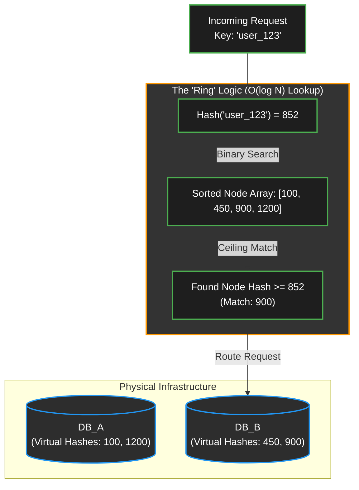

# Core Primitives - Consistent Hashing (From Theory to Code)

## 1. The Strategic Context
Consistent Hashing is the mathematical backbone of distributed systems like DynamoDB, Cassandra, and Discord. While theoretical discussions focus on a "Hash Ring," implementing an actual circular array of $2^{256}$ or $2^{128}$ elements is physically impossible. 

In production, Consistent Hashing is implemented using a **Sorted Array** (Binary Search) or an **Ordered Map** (Binary Search Tree). We only store the *nodes* (databases/ conn objects), not the empty space. When a request arrives, we find the first node whose hash is greater than or equal to the request's hash (the "Ceiling").

---

## 2. The Original Research
* [Consistent Hashing and Random Trees (Karger et al., 1997)](https://www.cs.princeton.edu/courses/archive/fall09/cos518/papers/chash.pdf) 
* *Note:* This MIT paper originally introduced the concept to solve web caching hot-spots, leading to the creation of Akamai.

---

## 3. Algorithmic Data Structures
To route a request efficiently, we use:
1. **Hash Function:** `MD5` or `SHA-256` to ensure uniform distribution. MD5 is often preferred in load balancing for its speed.
2. **Virtual Nodes (vNodes):** To prevent uneven data distribution, each physical database is hashed multiple times (e.g., `DB1-01`, `DB1-02`) and placed onto the ring.
3. **The Lookup Mechanism:** * Python: A Sorted List using the `bisect` module for `O(log N)` lookups.
    * C++: An Ordered Map (`std::map`) using the `lower_bound` function for `O(log N)` lookups.

---

## 4. Architecture Visualized


## Python Implementation
Python's bisect module is highly optimized for finding the insertion point (ceiling) in a sorted array.
```py
import hashlib
import bisect

class ConsistentHashRing:
    def __init__(self, replicas=3):
        """
        replicas: Number of virtual nodes per physical node.
        """
        self.replicas = replicas
        self.ring = []          # Sorted list of hash values
        self.hash_to_node = {}  # Maps hash value to physical node name

    def _hash(self, key):
        """Returns an integer hash for a given string using MD5."""
        m = hashlib.md5()
        m.update(key.encode('utf-8'))
        return int(m.hexdigest(), 16)

    def add_node(self, node):
        """Adds a physical node to the ring by creating virtual replicas."""
        for i in range(self.replicas):
            vnode_key = f"{node}#v{i}"
            vnode_hash = self._hash(vnode_key)
            
            self.hash_to_node[vnode_hash] = node
            bisect.insort(self.ring, vnode_hash) # Maintains sorted order O(N) insertion

    def remove_node(self, node):
        """Removes a physical node and all its virtual replicas."""
        for i in range(self.replicas):
            vnode_key = f"{node}#v{i}"
            vnode_hash = self._hash(vnode_key)
            
            del self.hash_to_node[vnode_hash]
            self.ring.remove(vnode_hash)

    def get_node(self, key):
        """Routes a key to the correct physical node."""
        if not self.ring:
            return None

        key_hash = self._hash(key)
        
        # Binary search for the first node hash >= key_hash
        idx = bisect.bisect_left(self.ring, key_hash)
        
        # Wrap around if the hash is greater than the largest node hash
        if idx == len(self.ring):
            idx = 0
            
        return self.hash_to_node[self.ring[idx]]

# Example Usage
if __name__ == "__main__":
    ch = ConsistentHashRing(replicas=100) # 100 vNodes for balanced distribution
    
    ch.add_node("Database_A")
    ch.add_node("Database_B")
    ch.add_node("Database_C")

    # Routing requests
    print(f"Request 'user_992' routes to: {ch.get_node('user_992')}")
    print(f"Request 'img_04x' routes to: {ch.get_node('img_04x')}")
```

## Cpp Implementation
In C++, std::map is implemented as a Red-Black Tree (a self-balancing Binary Search Tree). The lower_bound method natively returns an iterator to the first element that is greater than or equal to a given key, matching the Consistent Hashing requirement perfectly.
```cpp
#include <iostream>
#include <map>
#include <string>
#include <vector>
#include <functional>

class ConsistentHashRing {
private:
    int replicas;
    std::map<size_t, std::string> ring; // Red-Black Tree for O(log N) lookups

    // Simple hash function using std::hash (In production, use MD5/SHA256)
    size_t hash_key(const std::string& key) {
        return std::hash<std::string>{}(key);
    }

public:
    ConsistentHashRing(int r = 100) : replicas(r) {}

    void add_node(const std::string& node) {
        for (int i = 0; i < replicas; ++i) {
            std::string vnode_key = node + "#v" + std::to_string(i);
            size_t vnode_hash = hash_key(vnode_key);
            ring[vnode_hash] = node; // O(log N) insertion
        }
    }

    void remove_node(const std::string& node) {
        for (int i = 0; i < replicas; ++i) {
            std::string vnode_key = node + "#v" + std::to_string(i);
            size_t vnode_hash = hash_key(vnode_key);
            ring.erase(vnode_hash); // O(log N) deletion
        }
    }

    std::string get_node(const std::string& key) {
        if (ring.empty()) return "";

        size_t req_hash = hash_key(key);
        
        // lower_bound acts as the "Ceiling" function
        auto it = ring.lower_bound(req_hash); 

        // Wrap around logic: If iterator reaches the end, go back to the beginning
        if (it == ring.end()) {
            it = ring.begin();
        }

        return it->second;
    }
};

int main() {
    ConsistentHashRing ch(100);
    
    ch.add_node("Database_A");
    ch.add_node("Database_B");
    ch.add_node("Database_C");

    std::cout << "Request 'user_992' routes to: " << ch.get_node("user_992") << std::endl;
    std::cout << "Request 'img_04x' routes to: " << ch.get_node("img_04x") << std::endl;

    return 0;
}
```
