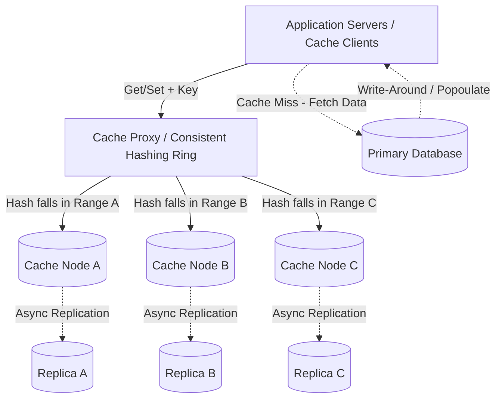

# Distributed Cache & High-Concurrency LRU

This document outlines the end-to-end design of a highly available distributed cache, scaling from the High-Level Architecture (HLD) down to the thread-safe, low-level concurrency primitives (LLD) required for 100K+ RPS throughput.

---

## 1. High-Level Design (HLD)

### Functional Requirements
* **Core Operations:** `put(key, value, ttl)`, `get(key)`, and `delete(key)`.
* **Eviction Policy:** Least Recently Used (LRU) to manage memory bounds.
* **Expiration:** Configurable Time-to-Live (TTL) for passive and active key expiration.

### Non-Functional Requirements
* **Throughput:** 100K+ Requests Per Second (RPS).
* **Latency:** < 10ms for read/write on the 99th percentile.
* **Scale:** Capable of distributing 1TB+ of in-memory data across a cluster.
* **Availability:** High Availability (HA) with fault tolerance. Eventual consistency is acceptable.

### Architecture Diagram


## 2. Low-Level Design (LLD): The Concurrency Trap
- To achieve O(1) time complexity for LRU operations, the standard approach combines a Hash Map and a Doubly Linked List (DLL).
- However, in a highly concurrent environment (e.g., a 32-core machine processing thousands of threads), a naive implementation fails:
- Global Lock: Wrapping the cache in a single Mutex causes extreme thread contention, turning a multi-core machine into a single-threaded bottleneck.
- Shared/Read-Write Locks: These fail because an LRU get() operation is actually a write (it modifies the DLL pointers to move the node to the Most Recently Used position).
- Node-Level Granular Locks: Locking individual cache nodes prevents value corruption but silently corrupts the global DLL when multiple threads attempt to update head.next simultaneously.

- Solution: Lock Striping (Sharding) : To solve memory corruption without sacrificing throughput, we use Lock Striping (the architecture powering high-performance structures like ConcurrentHashMap). We divide the cache into N independent shards, each with its own Lock, Hash Map, and DLL. Threads only block each other if their keys hash to the exact same shard.

## 3.1 Python Code
```py
import time
import threading
from typing import Dict, Optional, Any

class CacheNode:
    def __init__(self, key: str, value: Any, ttl_seconds: int):
        self.key = key
        self.value = value
        self.expire_at = time.time() + ttl_seconds if ttl_seconds > 0 else float('inf')
        self.prev: Optional['CacheNode'] = None
        self.next: Optional['CacheNode'] = None

    def is_expired(self) -> bool:
        return time.time() > self.expire_at

class ThreadSafeLRUShard:
    """A single, independently locked segment of the cache."""
    def __init__(self, capacity: int):
        self.capacity = capacity
        self.cache: Dict[str, CacheNode] = {}
        self.lock = threading.Lock()
        
        self.head = CacheNode("HEAD", None, 0)
        self.tail = CacheNode("TAIL", None, 0)
        self.head.next = self.tail
        self.tail.prev = self.head

    def _remove_node(self, node: CacheNode):
        prev_node = node.prev
        next_node = node.next
        prev_node.next = next_node
        next_node.prev = prev_node

    def _add_to_front(self, node: CacheNode):
        node.prev = self.head
        node.next = self.head.next
        self.head.next.prev = node
        self.head.next = node

    def get(self, key: str) -> Optional[Any]:
        with self.lock:
            if key not in self.cache:
                return None
            
            node = self.cache[key]
            if node.is_expired():
                self._remove_node(node)
                del self.cache[key]
                return None
                
            self._remove_node(node)
            self._add_to_front(node)
            return node.value

    def put(self, key: str, value: Any, ttl_seconds: int = 0):
        with self.lock:
            if key in self.cache:
                node = self.cache[key]
                self._remove_node(node)
                node.value = value
                node.expire_at = time.time() + ttl_seconds if ttl_seconds > 0 else float('inf')
                self._add_to_front(node)
            else:
                if len(self.cache) >= self.capacity:
                    lru_node = self.tail.prev
                    self._remove_node(lru_node)
                    del self.cache[lru_node.key]
                
                new_node = CacheNode(key, value, ttl_seconds)
                self.cache[key] = new_node
                self._add_to_front(new_node)

class ShardedConcurrentLRUCache:
    """The Orchestrator managing multiple independent shards to eliminate lock contention."""
    def __init__(self, total_capacity: int, num_shards: int = 256):
        self.num_shards = num_shards
        shard_capacity = max(1, total_capacity // num_shards)
        self.shards = [ThreadSafeLRUShard(shard_capacity) for _ in range(num_shards)]

    def _get_shard(self, key: str) -> ThreadSafeLRUShard:
        shard_index = hash(key) % self.num_shards
        return self.shards[shard_index]

    def get(self, key: str):
        return self._get_shard(key).get(key)

    def put(self, key: str, value: Any, ttl_seconds: int = 0):
        self._get_shard(key).put(key, value, ttl_seconds)
```
## 3.2 Cpp code with smart pointers for ownership and automatic memory management
```cpp
/**
Distributed LRU Cache Implementation
**/
#include <vector>
#include <unordered_map>
#include <list>

using namespace std;

class LRUCache {
    int capacity;
    list<pair<int, int>> dll;
    mutable mutex mtx;
    unordered_map<int, list<pair<int, int>>::iterator> lruCache;

    public:
    LRUCache(int cap): capacity(cap) {
    }

    int get(int key) {
        lock_guard<mutex> lock(mtx);
        if (lruCache.find(key) == lruCache.end()) {
            return -1;
        }
        
        int value = lruCache[key]->second;
        dll.erase(lruCache[key]);

        dll.push_front({key, value});
        lruCache[key] = dll.begin();
        return value;
    }

    bool put (int key, int value) {
        lock_guard<mutex> lock(mtx);
        if (lruCache.find(key) != lruCache.end()) {
            dll.erase(lruCache[key]);
        }
        dll.push_front({key, value});
        lruCache[key] = dll.begin();

        if (lruCache.size() > this->capacity) {
            int key = dll.back().first;
            dll.pop_back();
            lruCache.erase(key);
        }
    }
};

class ShardedLRUCache {
    int numOfShards;
    vector<unique_ptr<LRUCache>> cache;
    int capacityPerShard;
    public:

    ShardedLRUCache (int capacity, int cps) : numOfShards(capacity), capacityPerShard(cps) {
        for (int i = 0; i< numOfShards; ++i) {
            cache.push_back(make_unique<LRUCache>(capacityPerShard));
        }
    }

    int get(int key) {
        int shard = key % numOfShards;
        return cache[shard]->get(key);
    }

    bool put(int key, int value) {
        int shard = key % numOfShards;
        return cache[shard]->put(key, value);  
    }
};
```
## 4. Deep Dives & Edge Cases
Q: How do we route 1TB of data across multiple servers without crashing the database if a node dies?
A: We use Consistent Hashing. By mapping cache nodes and data keys to a virtual ring, the failure of a single node only forces the keys belonging to that specific node to be remapped to the next adjacent node. This prevents a massive, cluster-wide cache miss spike.

Q: How do we handle a "Cache Stampede" (Thundering Herd) when a highly requested hot key expires?
A: When a hot key expires, thousands of threads will simultaneously hit the database. We mitigate this using a Distributed Mutex Lock. The first thread to experience the cache miss acquires the lock and queries the DB. All other threads fail to acquire the lock and either serve stale data (probabilistic early expiration) or sleep and retry.

Q: Your LLD only has passive expiration (checking TTL on get). Won't unaccessed keys cause a memory leak?
A: Yes. In a production system, we pair this passive expiration with an Active Expiration Daemon Thread. This background worker periodically wakes up, samples a random subset of keys from the shards, and forcefully evicts any expired nodes to reclaim memory proactively.
