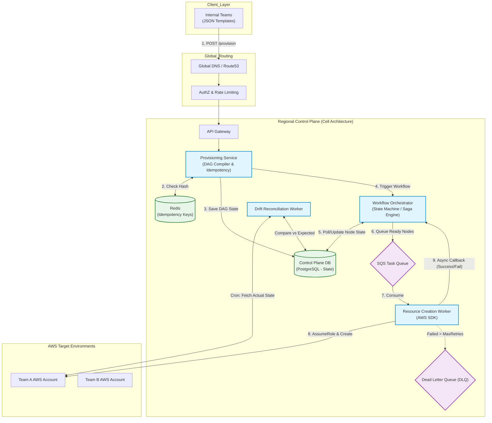

# System Design Deep Dive: Internal Control Plane (Cloud Resource Provisioner)

## Overview
This document outlines the architecture for an internal Control Plane designed to provision, manage, and monitor cloud resources across multiple AWS accounts and regions. Teams submit declarative JSON templates (Infrastructure-as-Code), and the system safely orchestrates the creation of resources (VPCs, EC2s, IAM Roles) while enforcing security policies and multi-tenant isolation.

**Constraint:** We cannot use off-the-shelf orchestrators like AWS CloudFormation or Terraform. We must build the underlying DAG execution engine ourselves.

---

## 1. Requirements

### Functional Requirements (FRs)
* **Declarative Provisioning:** Teams submit JSON templates specifying resource types, capacity, and target regions.
* **Dependency Management:** The system must identify topological dependencies (e.g., VPC must exist before Subnet).
* **Isolation:** Strict separation of resources per team using AWS Accounts, VPCs, and IAM Role-Based Access Control (RBAC).
* **Async Feedback:** Provisioning can take hours/days. Users need async notifications (Pub/Sub) or a polling portal.

### Non-Functional Requirements (NFRs)
* **High Availability & Multi-Region:** The Control Plane must survive regional outages without downtime.
* **Idempotency:** Re-submitting the exact same JSON template must not duplicate resources.
* **Eventual Consistency & Atomicity:** If a multi-step provisioning fails halfway, the system must rollback to prevent orphaned resources and billing leaks.
* **Observability:** Drift detection to ensure the Database state matches the actual Cloud provider state.

---

## 2. Core Entities

* `ProvisioningRequest`: `request_id`, `team_id`, `idempotency_hash`, `raw_json`, `status`
* `WorkflowDAG`: `dag_id`, `request_id`, `current_node`, `status` (PENDING, RUNNING, FAILED, COMPLETED)
* `ResourceNode`: `node_id`, `dag_id`, `resource_type` (e.g., AWS::EC2::Instance), `dependencies` (Array), `provider_arn`

---

## 3. High-Level Design (HLD)

## 4. Deep Dives
### Deep Dive 1: The DAG Execution Engine (Beyond simple Queues)
We cannot simply throw all requested resources into an SQS queue, because a Subnet creation will fail if its parent VPC hasn't finished provisioning.

- The Solution: The Provisioning Service acts as a compiler. It parses the JSON, builds a Directed Acyclic Graph (DAG) using Topological Sorting, and saves it to the DB.
- The Workflow Orchestrator acts as the state machine. It queries the DB for nodes with status = PENDING where all parent dependencies have status = COMPLETED. Only those "ready" nodes are pushed to the SQS Task Queue for the Creation Workers to execute.

### Deep Dive 2: "Atomicity" via the Saga Pattern
Cloud resources do not support ACID database transactions. If a 10-step provisioning process fails at step 5, we have 4 orphaned resources costing the company money.

- The Solution: We implement the Saga Pattern. Every Creation Worker implements both a Create() method and a Delete() compensating method.

- If Step 5 permanently fails (exceeds DLQ max retries), the Orchestrator automatically reverses the DAG, pulling the dependency chain backward and triggering the Delete() tasks for Steps 4, 3, 2, and 1, ensuring pseudo-atomicity.

### Deep Dive 3: Strict IAM Multi-Tenant Isolation
How does the Control Plane safely deploy resources into 100 different team accounts without leaking privileges?

- The Solution: The Control Plane never holds hardcoded AWS credentials for other teams. We use the AWS AssumeRole architecture.

- Team A provisions an IAM Role in their target account that explicitly trusts the Control Plane's AWS Account ID. When the Creation Worker picks up Team A's task, it makes an STS AssumeRole API call to generate temporary, 15-minute credentials scoped only to Team A's environment.

### Deep Dive 4: Cell-Based Multi-Region Architecture
To satisfy the "multi-region scale without downtime" requirement, we cannot use a single global database. If that DB goes down, the entire company is halted.

- The Solution: We utilize Cell-Based Architecture. Each AWS Region (e.g., us-east-1, eu-west-1) gets its own completely isolated deployment of the API, Orchestrator, and Database (a "Cell").

- Route53 uses Latency-Based Routing to direct the Team to the closest active Cell. If us-east-1 goes down, Route53 transparently fails traffic over to us-west-2. Because provisioning is declarative, the backup Cell can seamlessly continue operations.

### Deep Dive 5: Day-2 Operations (State Drift Reconciliation)
The biggest issue in custom control planes is "Drift"—the Database says the resource is active, but a human went into the AWS console and deleted it.

- The Solution: A decoupled Reconciliation Worker runs on an hourly cron. It queries the AWS API to get the true state of the world and compares it against the Control Plane DB. If drift is detected, it flags the WorkflowExecution as DRIFTED and fires an SNS alert to the owning team to either re-provision or update their JSON template.

- ## 5. Detailed Data Flow (Orchestration & Saga Pattern)

This section details the lifecycle of a resource provisioning request, highlighting how our Stateful Orchestrator (Temporal or AWS Step Functions) manages dependency execution, handles worker failures, and executes compensating transactions.

### Phase 1: Ingestion & DAG Compilation
1. **Request Submission:** The internal team submits a JSON infrastructure template via the API Gateway.
2. **Idempotency Check:** The `Provisioning Service` generates an MD5 hash of the `team_id` + `template_body`. It checks Redis to ensure this exact request isn't already in flight to prevent duplicate infrastructure.
3. **DAG Generation:** The `Provisioning Service` parses the JSON, identifies relationships, and uses Kahn's Algorithm to compile a Directed Acyclic Graph (DAG) of the resources (e.g., `VPC -> Subnet -> EC2`). 
4. **State Initialization:** The DAG is saved to the PostgreSQL database with all nodes marked as `PENDING`.
5. **Trigger Orchestrator:** The `Provisioning Service` triggers the `Workflow Orchestrator` (e.g., calls `StartExecution` in Step Functions or starts a Temporal Workflow), passing the `request_id`.

### Phase 2: The Execution Loop (Happy Path)
1. **Dependency Evaluation:** The Orchestrator queries the DAG state. It identifies "Zero-Dependency" nodes (nodes where all parent dependencies are `COMPLETED`). Initially, this is only the VPC.
2. **Task Dispatch:** The Orchestrator pushes a specific execution task (e.g., `Create_VPC`) to the Worker Pool. 
   * *Note:* If using Temporal, this is an `ExecuteActivity` call. If using Step Functions, this is triggering a Task State backed by SQS or Lambda.
3. **Worker Execution:** A `Resource Creation Worker` picks up the task, performs an `sts:AssumeRole` into the target team's AWS account, and executes the AWS SDK call to create the resource.
4. **Async Callback:** The worker receives the AWS response and sends a success callback to the Orchestrator, including the new `resource_arn`.
5. **State Update & Unblock:** The Orchestrator updates the PostgreSQL DB node to `COMPLETED`. This automatically unblocks the next node in the DAG (e.g., `Subnet`), and the loop repeats until all nodes are `COMPLETED`.

### Phase 3: The Saga Trigger (Unhappy Path & Rollback)
*If a worker encounters a fatal error (e.g., AWS Limit Exceeded) or exhausts its Dead Letter Queue (DLQ) retries, the Orchestrator initiates the Saga Pattern.*

1. **Failure Interception:** The Worker sends a `Failure` callback to the Orchestrator (or the Orchestrator catches a timeout exception).
2. **Halt Forward Momentum:** The Orchestrator instantly stops evaluating the DAG for new `PENDING` nodes. No new infrastructure will be created.
3. **Database Flagging:** The failed node is marked as `FAILED` in the PostgreSQL database.
4. **Reverse Execution (Compensation):** The Orchestrator queries the DB for all nodes in the current DAG that successfully reached the `COMPLETED` state.
5. **Delete Task Dispatch:** Iterating in **reverse topological order**, the Orchestrator dispatches `Delete` tasks to the workers. 
   * *Example:* If the workflow failed at EC2, it will dispatch a task to delete the Subnet, wait for success, and then dispatch a task to delete the VPC.
6. **Rollback Completion:** Once all compensating transactions succeed, the overall workflow is marked as `ROLLED_BACK`, ensuring pseudo-atomicity (zero orphaned resources).

### Phase 4: Asynchronous Notification
Because cloud provisioning is a long-running process (potentially taking hours), the client does not wait on an open HTTP connection.

1. **Event Emission:** Upon the terminal state of the workflow (either `COMPLETED` or `ROLLED_BACK`), the Orchestrator emits a final status event to an Amazon SNS Topic (or EventBridge).
2. **Team Notification:** * **Push:** Teams subscribed to the SNS topic via Webhooks or Slack integrations receive an instant push notification containing the provisioning results, resource ARNs, or failure logs.
   * **Pull:** Teams can optionally query a `GET /provisioning/{request_id}/status` endpoint at any time to see the live progress of their DAG traversing the state machine.
