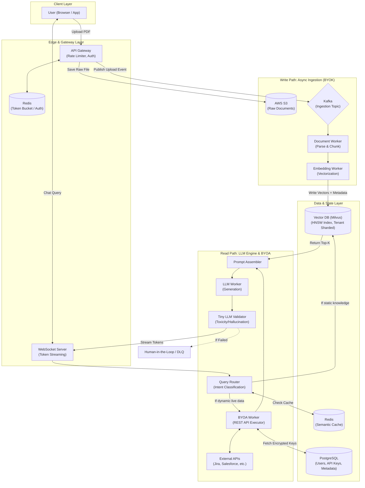

# System Design Deep Dive: Enterprise RAG Platform (BYOK & BYOA)

**Level:** L5
**Topic:** Retrieval-Augmented Generation, Event-Driven Ingestion, Agentic Workflows, Vector Databases
**Theme:** "Bring Your Own Knowledge" (BYOK) & "Bring Your Own API" (BYOA)

## 1. Problem Statement & Requirements

### Functional Requirements (FR)
* **Knowledge Ingestion (BYOK):** Users can upload static documents (PDFs, Confluence) to form a localized Knowledge Base (KB).
* **Conversational Retrieval:** Users can query the bot; the bot streams context-aware answers based on their specific KB.
* **Bring Your Own API (BYOA):** Users can register third-party API keys (e.g., Jira, Salesforce) so the bot can fetch real-time, dynamic data.
* **Response Validation:** Output must be verified for toxicity, PII leakage, and hallucinations.

### Non-Functional Requirements (NFR)
* **Low Latency:** Time-To-First-Token (TTFB) must be < 500ms. 
* **High Availability:** 99.99% uptime for the chat interface.
* **Multi-Tenant Security:** Strict isolation; Tenant A cannot retrieve Tenant B's embeddings.
* **Scalability:** Must absorb sudden traffic spikes (e.g., 100x ingestion bursts) without crashing inference workers.

---

## 2. Back-of-the-Envelope (BoTE) Estimation
*Assumptions: B2B Enterprise Platform, 10,000 corporate tenants, 1M Daily Active Users (DAU).*

* **Traffic:** 1M DAU * 10 queries/day = 10 Million queries/day (~115 QPS average, 500 QPS peak).
* **Storage (Vector DB):** * 10M documents total * 100 chunks/doc = 1 Billion chunks.
  * Using OpenAI `text-embedding-3-small` (1536 dimensions) = ~6KB per vector.
  * 1 Billion * 6KB = **~6 Terabytes** of pure vector storage (excluding metadata/indices).
* **Compute:** 500 QPS requires robust rate-limiting and auto-scaling GPU workers for LLM inference.

---

## 3. High-Level Architecture (HLD)

## 4. Deep Dives & Trade-offs

### 4.1. Search Strategy: Dense vs. Sparse vs. Hybrid
* **The Problem:** Standard RAG uses Dense Vector Search (Cosine Similarity). This is great for semantic meaning ("How do I request time off?") but terrible for exact keyword matching (e.g., "Find Jira ticket PROJ-8821"). Dense vectors blur exact IDs.
* **The Trade-off / Solution:** We implement **Hybrid Search**. We run a Dense Vector search (semantic) AND a Sparse BM25 search (keyword/lexical) in parallel. We then combine the results using **Reciprocal Rank Fusion (RRF)**. This costs more compute but drastically increases retrieval accuracy for enterprise workflows.

### 4.2. Mutable Knowledge (The Delete/Update Problem)
* **The Problem:** Ingesting a PDF is easy. But what happens when a user *deletes* a document from their Knowledge Base? We have to find and delete 500 scattered vector chunks in the Vector DB.
* **The Trade-off / Solution:** Vector DBs are notorious for slow deletions. Instead of immediate hard deletes, we append a `document_uuid` to the metadata of every chunk. When a document is deleted, we mark the `document_uuid` as "deleted" in PostgreSQL (a fast SQL transaction) and publish a tombstone event to Kafka. A background cron job slowly sweeps the Vector DB to prune deleted vectors during off-peak hours.

### 4.3. Cost vs. Latency (LLM Routing/Cascade)
* **The Problem:** Sending every single query to GPT-4 or Claude Opus is extremely expensive and introduces high latency (TTFB > 1s).
* **The Trade-off / Solution:** We implement an **LLM Cascade**. We use a fast, cheap model (like Llama-3-8B) as the initial `Query Router`. If the user asks a simple greeting ("Hello"), it responds immediately. If the router detects a complex analytical query, it dynamically routes the request to the expensive, heavyweight model.

---

## 5. Database, Partitioning, and Indexing Strategies

| Component | Technology | Staff-Level Justification |
| :--- | :--- | :--- |
| **Vector DB** | **Milvus / Pinecone** | Built for billion-scale vectors. Supports Hybrid Search natively. |
| **Indexing Algorithm** | **HNSW** | Standard K-Nearest Neighbor (KNN) is $O(N)$. HNSW (Hierarchical Navigable Small World) uses a multi-layered graph to achieve Approximate Nearest Neighbors (ANN) in $O(\log N)$ time, crucial for low latency. |
| **Partitioning** | **Tenant Sharding** | Vectors are physically or logically partitioned by `tenant_id`. We apply a **Metadata Pre-Filter** before the vector search, guaranteeing zero cross-tenant data leaks and limiting the search space to a single company's data. |
| **Cache** | **Redis (Semantic Cache)** | If Query B has a 0.98 cosine similarity to Query A, we return Query A's cached LLM response. This bypasses the LLM entirely, saving massive API costs and dropping TTFB to < 50ms. |

---

## 6. Observability & Resiliency Matrix

| Risk / Component | Observability Tool | Key Metric | Staff-Level Mitigation Strategy |
| :--- | :--- | :--- | :--- |
| **API Edge** | CloudWatch / Grafana | **Rate (HTTP 429s)** | Implement **Token Bucket Rate Limiting** per tenant via Redis. |
| **LLM Inference** | Datadog / OpenTelemetry | **TTFB & TTSB** | If external LLM API degrades, trigger a **Circuit Breaker**. Degrade gracefully by returning a cached "high-load" message. |
| **Async Ingestion** | Prometheus | **Consumer Lag** | Use **Horizontal Pod Autoscalers (HPA)** to spin up more ingestion pods based on Kafka queue depth. |
| **Worker Crash** | ELK Stack (JSON Logs) | **OOMKilled** | **Poison Pill Pattern:** Catch parsing errors, push the malformed PDF to a **Dead Letter Queue (DLQ)**, and commit the offset to unblock the Kafka partition. |
| **Output Quality** | LangSmith / Arize AI | **Hallucination Score** | Run a fast **Validator Agent** in parallel. If toxicity is detected, halt the WebSocket stream and route to a Human-in-the-Loop. |

---

## 7. Future Scope: The Evolution to Agentic Architecture

To ensure longevity, the system is designed to evolve across three phases:

1. **Phase 1: Static RAG (Current):** User asks -> Vector DB retrieves text -> LLM answers. (Cannot execute actions).
2. **Phase 2: Dynamic GraphRAG (Next 12 Months):** Combining Vector Search with **Knowledge Graphs** to understand entity relationships (e.g., "Company A is a subsidiary of Company B").
3. **Phase 3: Autonomous Agents (1-3 Years):** Implementing the **ReAct (Reason + Act)** framework. 
   * The LLM stops being a simple text generator and becomes a reasoning orchestrator.
   * *Example:* User says, "Audit my AWS bill." The LLM *plans* the audit, *chooses* to trigger the BYOA AWS API, *fetches* the data, *reflects* on the numbers, and *generates* the final report autonomously.
