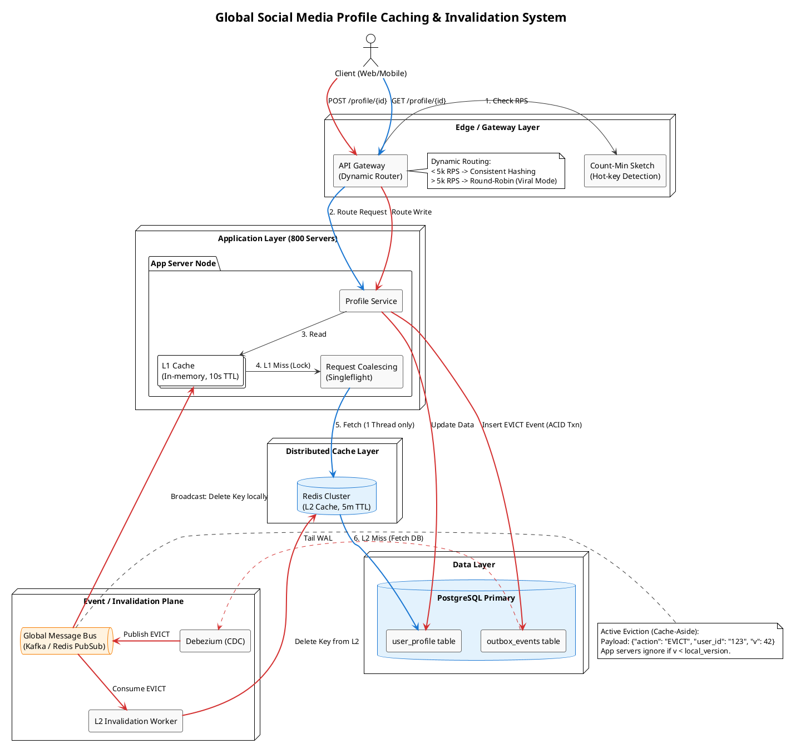

# System Design: Global Social Media Profile Caching & Invalidation System

## 1. Problem Statement

**The Context:** A social media platform caches user profiles in a multi-tier architecture:

* **L1 Cache:** In-process, per application server (800 servers), 10-second TTL.
* **L2 Cache:** Distributed Redis cluster, 5-minute TTL.
* **Source of Truth:** PostgreSQL database.

**The Scale:** 2,000,000 profile reads per second (RPS) with a 99.7% cache hit rate.

**The Incident:** A corrupted profile update was written to the DB and L2 cache. Even after the DB was fixed, the corrupted data lingered in L2 for 5 minutes and L1 for 10 minutes. A "Celebrity" user's corrupted profile was viewed 14 million times.

**The Goal:** Design a system that guarantees cache invalidation across all L1 and L2 nodes globally within **1 to 10 seconds** of an update or admin fix, while surviving 2M RPS and severe viral hot-key spikes.

---

## 2. Requirements Gathering

### Functional Requirements

* **Profile Reads:** Users must be able to view profiles with sub-50ms latency.
* **Profile Updates:** Users (or Admins) can update profile metadata (bio, avatar URL).
* **Global Invalidation:** Any update/rollback must purge stale data from all caching layers within 10 seconds.

### Non-Functional Requirements

* **High Availability:** The read path must survive 2M RPS without cascading failures.
* **Strict Eventual Consistency:** Caches must converge to the database truth rapidly. No infinite staleness.
* **Hot-Key Survivability:** The system must handle single-profile viral spikes (e.g., 14M views) without crashing individual app servers or Redis nodes.

---

## 3. Back-of-the-Envelope (BoE) Calculations

* **Read Traffic:** 2,000,000 RPS.
* **Cache Miss Rate:** At 99.7% hit rate, the miss rate is 0.3%.
* **Database Load:** 2,000,000 * 0.003 = **6,000 RPS** hitting PostgreSQL. (This is manageable for a read-replica cluster, but dangerous if it spikes).
* **Viral Spike Impact:** 14,000,000 views over 10 minutes = ~23,000 RPS targeting a *single* user profile. If routed to a single node, that node will crash.

---

## 4. High-Level Architecture

The architecture decouples the highly concurrent **Read Path** from the strict, event-driven **Write/Invalidation Path**.

### The Read Path (Dynamic Routing)

1. **API Gateway:** Receives the `GET /profile/{user_id}` request.
2. **Dynamic Router:** Routes the request to one of the 800 Application Servers.
3. **L1 Cache Check:** The App Server checks local memory. If hit, return immediately (<1ms).
4. **Request Coalescing:** If L1 miss, acquire an in-memory lock for that `user_id`.
5. **L2 Cache Check:** The single permitted thread queries Redis. If hit, populate L1, release lock, return.
6. **DB Fetch:** If L2 miss, query Postgres, populate L2, populate L1, release lock, return.

### The Write & Invalidation Path (Event-Driven Cache-Aside)

1. **Profile Update:** A `POST /profile/{user_id}` request hits the Profile Service.
2. **Transactional Outbox:** The service opens an ACID transaction to Postgres. It updates the `user_profile` table AND inserts an `EVICT` event into an `outbox_events` table.
3. **Change Data Capture (CDC):** A background worker (e.g., Debezium) tails the Postgres Write-Ahead Log (WAL) and publishes the `EVICT` event to a global Kafka topic / Redis PubSub bus.
4. **Global Broadcast:**
* A dedicated worker consumes the event and explicitly deletes the key from the **L2 Redis Cluster**.
* Simultaneously, all **800 Application Servers** are subscribed to the PubSub bus. They receive the event and instantly delete the key from their **L1 Local Memory**.

---

## 5. Deep Dives & Trade-Offs

### Deep Dive 1: The "Celebrity Problem" & Dynamic Routing

**The Trap:** Using strict Consistent Hashing on the read path. If Justin Bieber updates his profile and gets 23,000 RPS, Consistent Hashing forces 100% of that traffic to a single App Server. That server will melt.
**The Solution: Two-Tier Dynamic Routing**

* **Normal Traffic (Default):** The API Gateway uses Consistent Hashing. This guarantees a high L1 cache hit rate because requests for User A always land on Server A. L2 Redis network costs are minimized.
* **Hot-Key Detection:** The Gateway maintains a Count-Min Sketch. If a specific `user_id` crosses 5,000 RPS, the Gateway flips its routing strategy for *that key only* to **Round-Robin**.
* **The Trade-off:** Round-Robin disperses the 23,000 RPS across all 800 servers. We sacrifice a brief burst of L2 reads (as all 800 servers experience an L1 miss to fetch the profile), but we completely eliminate the single-point-of-failure crash risk.

### Deep Dive 2: Active Eviction (Delete) vs. Active Population (Update)

**The Trap:** When an admin fixes a corrupted profile, publishing the full new profile payload over the message bus to update the caches.
**The Solution: Active Eviction (Cache-Aside).**

* We send a tiny message: `{"action": "EVICT", "user_id": 12345, "version": 42}`.
* **Why? (Bandwidth & Compute):** Broadcasting large image URLs and text blobs to 800 servers wastes massive internal bandwidth. Furthermore, 700 of those servers might never even receive a read request for that user. By deleting the key, we force the servers to lazy-load the correct data *only if* a user actually requests it.

### Deep Dive 3: Preventing the Thundering Herd (Request Coalescing)

**The Trap:** When the invalidation event clears L1 and L2 globally, the very next second, 10,000 concurrent read requests for that profile hit the system. They all experience a cache miss and hit Postgres simultaneously, bringing down the database.
**The Solution: Singleflight (Request Coalescing).**

* Implemented at both the App Server (L1) and the Cache Gateway (L2) levels.
* When 10,000 requests for `user_123` hit an App Server and experience an L1 miss, the server halts 9,999 threads. It allows exactly *one* thread to make the network call to Redis/Postgres. When that one thread returns with the data, it populates the cache and instantly fulfills all 10,000 waiting requests. Postgres only ever sees 1 query.

### Deep Dive 4: Race Conditions & Versioning (Vector Clocks)

**The Trap:** A user updates their profile twice in 2 seconds (Update A, then Update B). Due to network jitter, the `EVICT_A` message arrives at an App Server *after* `EVICT_B`. The server evicts the cache, a new read pulls data B, but then `EVICT_A` hits, potentially causing weird states or fetching old data if DB replication is lagging.
**The Solution: Monotonically Increasing Versions.**

* Every profile update increments a `version` column in Postgres.
* The invalidation message contains this version: `{"user_id": 123, "version": 5}`.
* The caches (L1 and L2) store the payload *with* its version. If an App Server receives an invalidation event with a version *lower* than what it currently has in memory, it ignores it.

---

## 6. Summary of Constraints Met

1. **1 to 10 Second SLA:** Achieved via CDC and Redis PubSub/Kafka. The DB write triggers a sub-second broadcast event that purges L1 and L2 almost instantly, completely bypassing the 5-minute and 10-second TTLs.
2. **Surviving 14M Views (Corrupted or Not):** Achieved via Dynamic Routing. Viral traffic is dispersed via Round-Robin across 800 nodes, preventing any single L1 node from maxing out its CPU.
3. **Database Protection:** Achieved via Request Coalescing. Even with 800 nodes globally clearing their caches simultaneously, singleflight guarantees that massive concurrent misses translate to negligible database queries.
